# KoreanPKCov-Core v4.6 — PI-ready Final Launch Playbook

> **본 문서는 v4.5.3을 freeze하고, v4.6에서 (1) vine copula 이론적 정당화, (2) Gate D null 시 PhD 1저자 챕터 가치 확인 절차, (3) benchmark 실명 citation 삽입, (4) reviewer attack defense map 추가, (5) 시각화 강화만 패치한 PI 미팅용 최종본입니다. 재설계가 아닙니다.**

---

## 📑 Table of Contents

| § | Section | 핵심 내용 |
|---|---|---|
| 0 | [문서의 성격](#0-문서의-성격) | v4.6은 visual realignment + reviewer-defense patch |
| 1 | [한 페이지 PI Brief](#1-한-페이지-pi-brief-executive-summary) | 지도교수께 보여드릴 1면 요약 |
| 2 | [v4.5.3 → v4.6 변경 요약](#2-v453--v46-변경-요약) | 무엇이 바뀌었는가 |
| 3 | [거시 흐름도 + 타임라인](#3-거시-흐름도--타임라인) | mermaid flowchart + Gantt |
| 4 | [효용 진단 + 메타 평가](#4-효용-진단--메타-평가) | "이 아이디어가 정말 큰 효용을 낼 수 있는가" |
| 5 | [프로젝트 정체성 + Claim Boundary](#5-프로젝트-정체성--claim-boundary) | 정체성 freeze, 표현 lock |
| 6 | [Pre-D0 Gates: P, T](#6-pre-d0-gates-p-t) | PI 정렬, 실행자 준비도 |
| 7 | [Scope Lock + Variable Manifest](#7-scope-lock--variable-manifest) | 무엇을 하지 않는가 |
| 8 | [eGFR Panel Policy](#8-egfr-panel-policy) | 19–25세 transition zone |
| 9 | [Subgroup Pre-specification](#9-subgroup-pre-specification) | edge subgroup lock + n rule |
| 10 | [Sampler Architecture + Vine Copula 정당화](#10-sampler-architecture--vine-copula-정당화-새로운-패치) | **v4.6 신규 정당화 섹션** |
| 11 | [Adapter Layer + Sanity Check](#11-adapter-layer--sanity-check) | base→derived 변환 |
| 12 | [Benchmark Policy (Full Citations)](#12-benchmark-policy-full-citations) | **v4.6 실명 인용 삽입** |
| 13 | [Gate D — Dependency Utility](#13-gate-d--dependency-utility) | 효과크기 정의 + null 대응 |
| 14 | [Release Tier System](#14-release-tier-system) | 공개 수준 selector |
| 15 | [DMP & Privacy Firewall](#15-dmp--privacy-firewall) | 데이터 관리 + privacy metrics |
| 16 | [Risk Register](#16-risk-register) | 리스크 + 발생 시 대응 |
| 17 | [Repository Structure](#17-repository-structure) | 폴더 트리 |
| 18 | [Target Journal Branching](#18-target-journal-branching) | 결과별 저널 분기 |
| 19 | [Model-Readiness Index](#19-model-readiness-index) | 약물별 readiness 점수 |
| 20 | [Reviewer Attack Defense Map](#20-reviewer-attack-defense-map-v46-신규) | **v4.6 신규** 심사위원 공격 방어 |
| 21 | [Final Execution Decision](#21-final-execution-decision) | 지금 할 일 |
| A | [Appendix A — PI 1-page Brief 복붙본](#appendix-a--pi-1-page-brief-복붙본) | 인쇄용 |
| B | [Appendix B — D0–D3 Output Manifest](#appendix-b--d0d3-output-manifest) | 산출물 체크리스트 |
| C | [Appendix C — v4.6 Change Log](#appendix-c--v46-change-log) | 변경 이력 |

---

## 0. 문서의 성격

```yaml
project: KoreanPKCov-Core
internal_strategic_alias: "Data Moat"
version: 4.6
status: "PI-ready, awaiting Gate P"
revision_type: "Visual realignment + reviewer-defense patch (NOT redesign)"
predecessor: v4.5.3
```

| 구분 | v4.6 결정 |
|---|---|
| **무엇이 바뀌었나** | (1) vine copula 이론적 정당화 섹션 신설 (2) Gate P 어젠다에 "Gate D null 시 PhD 챕터 가치 확인" 한 줄 추가 (3) "Hong 2019 / Jeong 2024" shorthand 제거 → Kim DJ 2019 / Kim YK 2024 실명 citation 삽입 (4) Reviewer Attack Defense Map 신설 (5) 모든 다이어그램 mermaid로 시각화 |
| **무엇이 freeze되었나** | 정체성, 3-layer 효용 구조, Gate 전체 구조, scope lock, sampler 3-track 원칙, release tier, claim boundary 문구, DMP, 산출물 6종 |
| **이 문서의 운명** | 지도교수 미팅 시 그대로 들고 가서 Gate P 받음 → 통과하면 D-1 작업 시작 |

---

## 1. 한 페이지 PI Brief (Executive Summary)

| 항목 | 내용 |
|---|---|
| **한 줄 정의** | 공개 KNHANES 성인 자료를 바탕으로 한국인 pharmacometric simulation에 필요한 생리 공변량 결합분포를 survey-weighted 방식으로 재구축하는 **공개·재구축 가능 covariate engine** |
| **핵심 가설 (72시간 안에 죽일 수 있는)** | 한국 성인 KNHANES base covariate joint distribution은 marginal-only sampling 대비 사전 지정 edge subgroup의 simulation output을 **ΔPTA ≥ 5%p**로 변화시킨다 |
| **왜 중요한가** | 후속 PopPK, MIDD, renal-sensitive drug simulation에서 한국인 covariate prior를 **재사용 가능**하게 만든다 |
| **무엇이 아닌가** | ❌ 임상 용량 권고 도구 ❌ 한국 최초 가상집단 ❌ regulatory-grade validated database ❌ 소아·PGx·biobank 통합 플랫폼 |
| **null 결과여도 남는 자산** | Local Forge package, Covariate Atlas, Dependency Stress-Test Report, Model-Readiness Index, methodological note |
| **PI께 요청드리는 결정** | (a) 72시간 kill-test 진입 허가 (b) **본 프로젝트의 위치**: 학위논문 1저자 챕터 / 사이드 프로젝트 / 방법론 예비연구 / 보류 (c) **Gate D null 결과물(Atlas + methodological note)이 학위논문 1저자 챕터로 인정 가능한지 명시적 확인** |

---

## 2. v4.5.3 → v4.6 변경 요약

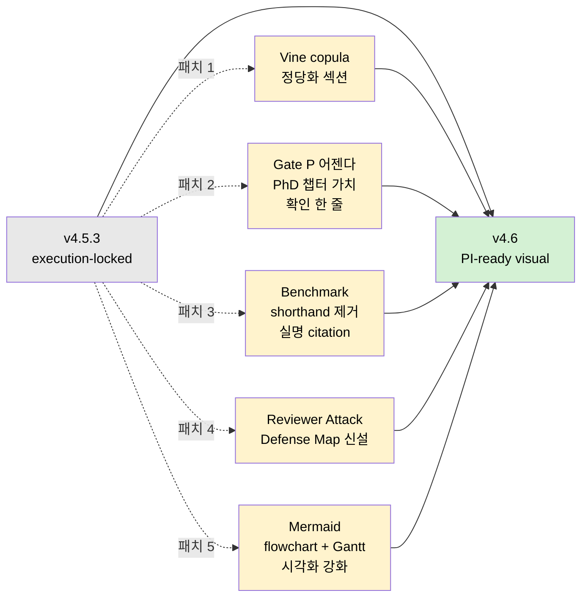

| 패치 | 내용 | 위치 |
|---|---|---|
| **P1** | Vine copula 이론적 정당화 — pair-copula decomposition, tail dependency, MVN 비교 | §10 (sub: Methodological Justification) |
| **P2** | Gate P 어젠다에 "Gate D null 결과물의 PhD 챕터 가치 확인" 한 줄 추가 | §6.1 |
| **P3** | "Hong 2019 / Jeong 2024" shorthand 전면 제거 → **Kim DJ et al. (2019)** + **Kim YK et al. (2024)** 실명 citation | §12 |
| **P4** | Reviewer Attack Defense Map (5대 공격 + 방어선) 신설 | §20 |
| **P5** | 모든 흐름도/타임라인을 mermaid로 시각화, 표 형식 일관성 강화 | §3, §6, §13 |

---

## 3. 거시 흐름도 + 타임라인

### 3.1 전체 흐름도

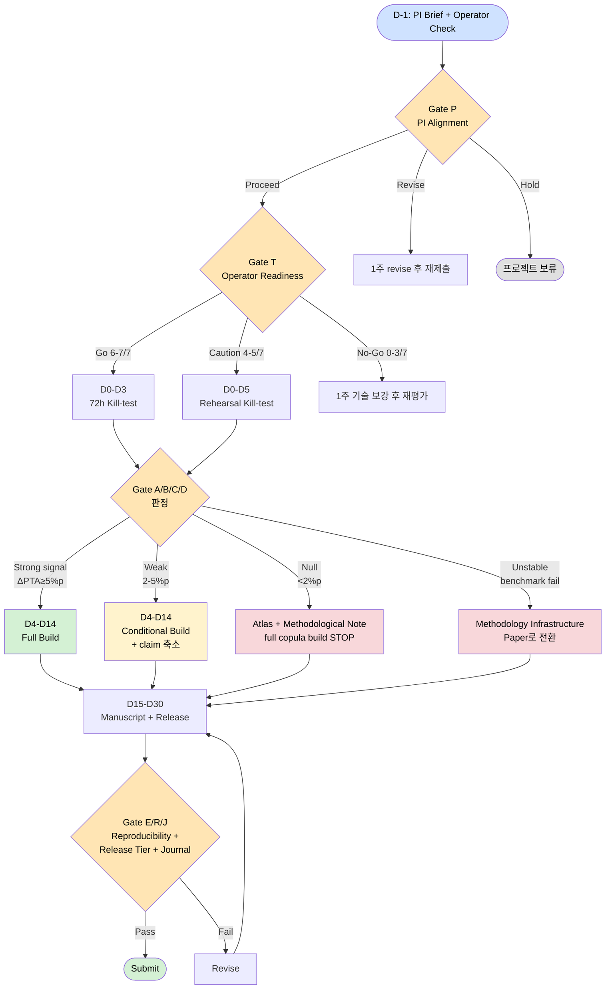

### 3.2 Gantt 타임라인

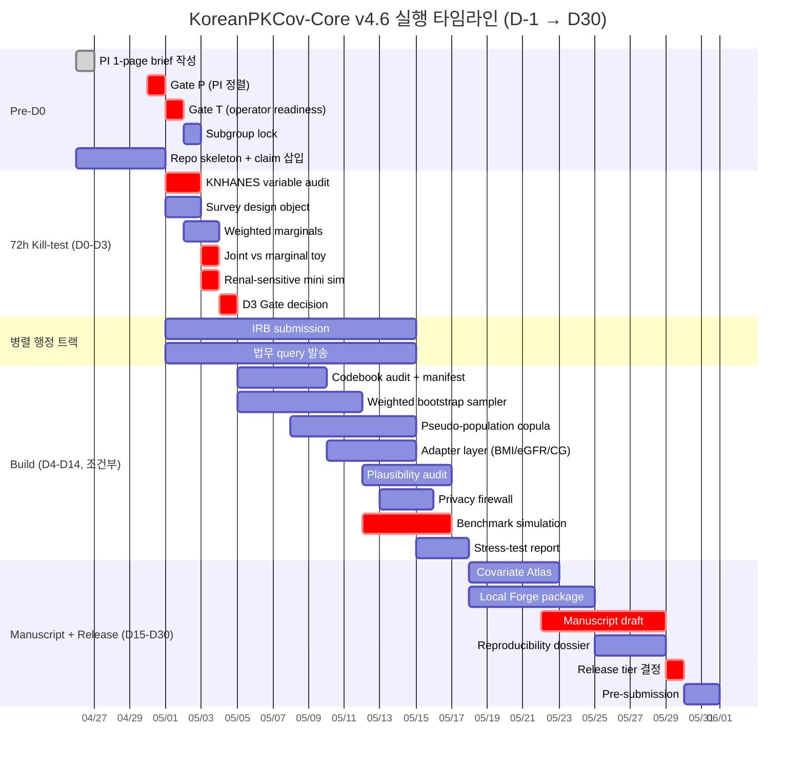

> ⚠️ **중요**: Gate P / Gate T / D3 Gate decision / 최종 release tier 결정은 모두 **critical path** 상에 있어 슬립 시 후속 일정 전체가 밀립니다.

---

## 4. 효용 진단 + 메타 평가

### 4.1 3-Layer 효용 구조 (frozen from v4.5)

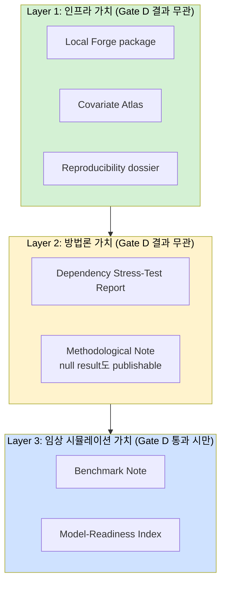

**핵심 논리**: Layer 3가 무너져도 Layer 1·2는 살아남도록 설계. 이 구조가 v4.4 → v4.5의 핵심 진보이며, v4.6에서도 freeze.

### 4.2 메타 평가 — "이 아이디어가 성공해도 정말 큰 효용을 낼 수 있는가?" (v4.6 솔직 진단)

| 판단 기준 | 평가 | 근거 |
|---|---|---|
| **실제 갭이 존재하는가** | ✅ 타당 | SimCYP 한국 가상집단(2019)은 폐쇄형. 공개·재구축 가능한 코어는 부재 |
| **후속 연구 레버리지가 있는가** | ✅ 타당 | Layer 1 인프라는 PIPET-Vault 연구실 내부 표준 도구로 지속 사용 가능 |
| **임팩트 상한이 충분한가** | ⚠️ **조건부** | Gate D null이면 methodological note 수준. CPT:PSP 게재는 가능하지만 high-impact 논문은 아님 |
| **타이밍이 맞는가** | ✅ 타당 | K-바이오 규제과학 확장기 + FDA Project Optimus 이후 비서구 PK 데이터 수요 증가 |
| **PhD 1저자 챕터로 충분한가** | ⚠️ **조건부** | Gate D **strong signal 시에만** 1저자 챕터 가치 확실. null 시에는 사이드 챕터 또는 방법론 예비연구 수준 → **Gate P에서 PI 명시 확인 필요** |

> 🔴 **솔직한 메타 진단**: 본 프로젝트는 "성공 시 큰 효용"이 보장된 프로젝트가 **아닙니다**. Gate D 결과에 따라 "후속 연구 인프라가 살아남는 프로젝트"와 "PhD 핵심 챕터" 사이를 오갑니다. 이 점을 PI가 미리 인지하고 위치를 정해주시는 것이 v4.6의 핵심 요청사항입니다.

---

## 5. 프로젝트 정체성 + Claim Boundary

### 5.1 정체성 (freeze)

> **English**: KoreanPKCov-Core is an open-source, survey-weighted, reproducibility-audited Korean adult pharmacometric covariate engine derived from public KNHANES microdata, with deterministic adapter layers for downstream PopPK simulation and benchmark utility evaluation.

> **한국어**: KoreanPKCov-Core는 공개 KNHANES 성인 미시자료를 기반으로 한국인 pharmacometric simulation에 필요한 생리 공변량 결합분포를 복합표본설계에 맞게 재구축하고, downstream PopPK 모델에 연결할 수 있도록 deterministic adapter layer를 제공하는 오픈형 공변량 엔진이다.

### 5.2 표현 lock

| ✅ 허용 | ❌ 금지 |
|---|---|
| open-source | 한국 최초 / 세계 최초 |
| survey-weighted | regulatory-grade |
| dependency-preserving | FDA-accepted |
| locally rebuildable | clinical dosing tool |
| model-adaptable | validated clinical database |
| reproducibility-audited | comprehensive Korean virtual patient platform |
| regulatory-aligned | ready for submission tonight |

### 5.3 Claim Boundary (manuscript / IRB / README / 슬라이드 첫 장 동일 삽입)

> **English**: This project does not provide clinical dosing recommendations. The vancomycin case study is used only as a renal-function-sensitive benchmark to evaluate whether dependency-preserving Korean covariate generation can alter pharmacometric simulation outputs in pre-specified edge subgroups.

> **한국어**: 본 프로젝트는 임상 용량 권고 도구가 아니다. 반코마이신 사례는 신기능 민감 benchmark로만 사용하며, 목적은 한국인 공변량 결합분포 보존 여부가 사전 정의된 edge subgroup의 simulation output을 변화시키는지 평가하는 것이다.

---

## 6. Pre-D0 Gates: P, T

### 6.1 Gate P — PI Alignment Gate

**목적**: D0 전에 본 프로젝트가 학위 자원에서 차지하는 위치를 확정한다.

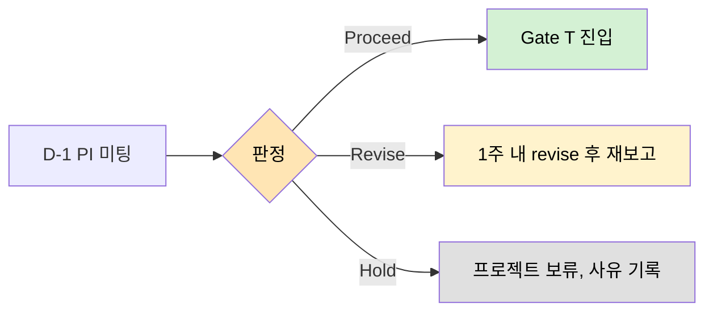

#### Gate P 어젠다 (PI께 받아야 할 결정)

| # | 어젠다 | 왜 필요한가 |
|---|---|---|
| 1 | 본 프로젝트의 위치 (학위 1저자 챕터 / 사이드 / 예비연구 / 보류) | 자원 배분 결정 |
| 2 | 72시간 kill-test 진입 허가 | D0 진입 사인 |
| 3 | claim boundary 문구 동의 | 표현 통제 사인 |
| 4 | Edge subgroup 사전 지정 동의 | 사후해석 차단 |
| 5 | **🔴 (v4.6 신규) Gate D null 결과물(Atlas + methodological note)이 학위논문 1저자 챕터로 인정 가능한지 명시적 확인** | **null 시나리오에서의 챕터 가치를 PI 판단에 위임하되, D-1에 미리 받아두는 구조** |
| 6 | Target journal 1차 후보 (CPT:PSP) 적합성 동의 | 출구 전략 사인 |

#### 산출물

| 파일 | 내용 |
|---|---|
| `P0_one_page_PI_brief.pdf` | §1 압축본 |
| `P0_PI_alignment_minutes.md` | PI 코멘트, 허용·금지 범위, **null 시 챕터 가치 판단 (v4.6 신규)** |
| `P0_decision.md` | Proceed / Revise / Hold |

### 6.2 Gate T — Operator Readiness Gate (v4.5.2 패치 반영)

**목적**: D0–D3가 R 학습 주간으로 붕괴되는 것을 사전 차단한다.

#### 7항목 체크리스트 (v4.5.1 6항목 → v4.6 7항목)

| # | 영역 | 최소 통과 기준 | 실패 시 조치 |
|---|---|---|---|
| 1 | R data loading | `haven::read_sas()`로 KNHANES SAS 파일 로딩 | D0 보류 |
| 2 | Survey design | `survey::svydesign()` 객체 생성 | kill-test 5일로 재계획 |
| 3 | Weighted summary | weighted mean / quantile / correlation 산출 | marginal summary만 우선 |
| 4 | Bootstrap | weight 기반 resampling 가능 | empirical bootstrap만 시행 |
| 5 | **🔴 Vine copula (v4.6 신규)** | **toy continuous dataset에서 `rvinecopulib`로 family selection → fit → simulate → inverse transform 완료 가능** | **copula build 보류, bootstrap을 primary로** |
| 6 | mrgsolve | toy 1-/2-compartment simulation 가능 | benchmark를 simplified CL model로 축소 |
| 7 | Version control | Git repo + seed + session info 저장 | full build 금지 |

#### 판정

| 점수 | 판정 | Action |
|---|---|---|
| 6–7 / 7 | 🟢 **Go** | D0 진입 |
| 4–5 / 7 | 🟡 **Caution** | D0–D5 rehearsal kill-test (signal 검증보다 pipeline rehearsal 우선) |
| 0–3 / 7 | 🔴 **No-Go** | 1주 기술 보강 후 재평가 |

---

## 7. Scope Lock + Variable Manifest

### 7.1 Scope Lock

| 영역 | ✅ Launch Core (v4.6) | ❌ Out of Scope (v5.x로 이연) |
|---|---|---|
| 대상 | 만 19세 이상 성인 | 소아·청소년 전 범위 |
| 자료 | KNHANES public microdata only | EMR 연계, 병원 cohort |
| 공변량 | age, sex, height, weight, waist, SCr, AST, ALT 중심 | linked PGx, biobank genotype |
| 신기능 | CKD-EPI 2009 / 2021, EKFC, Korean FAS, CG | 소아식 (Schwartz 등) |
| Sampler | weighted empirical bootstrap + pseudo-population copula | hierarchical 다층 모델 |
| Utility | vancomycin renal-sensitive benchmark | 임신, ECMO, 소아 ARC, ADC |
| 공개 | Tier Core default | Tier Full (법무 명시 허용 시만) |
| 인터페이스 | R package / CLI / script | Shiny app, web GUI |

### 7.2 Variable Manifest v0.1

> 🔑 **Core Principle**: Copula에는 **base variable만** 넣는다. 파생 변수(BMI, BSA, eGFR, CrCL)는 sampler 입력 X, adapter 출력 ✓.

| Category | Variables | v4.6 Decision |
|---|---|---|
| **Base input** | age, sex, height, weight, waist, SCr, AST, ALT | 🟢 sampler input |
| **Conditional add-on** | albumin, bilirubin, glucose, HbA1c | 🟡 codebook audit 후 포함 |
| **Derived adapter** | BMI, BSA, CKD-EPI 2009, CKD-EPI 2021, EKFC, Korean FAS, CG CrCL | 🔵 sampling 후 계산 |
| **Model adapter** | WT, CrCL, renal class, hepatic flags, dose scalars | 🔵 drug model별 변환 |
| **Optional reporting** | 19–25 transition flag, hyperfiltration flag | 🟡 sensitivity interpretation |
| **Excluded at launch** | pediatric eq., PGx, biobank, hospital-only | ⚫ v5.x |

> ❌ **금지**: BMI, BSA, eGFR, CrCL을 base copula input에 직접 넣지 않는다 (derived-variable leakage 방지).

---

## 8. eGFR Panel Policy

### 8.1 성인 기본 정책

| 식 | 역할 |
|---|---|
| CKD-EPI 2009 | legacy comparator |
| CKD-EPI 2021 | sensitivity comparator |
| **EKFC** | **한국 성인 및 19–25세 기본값 후보** |
| Korean FAS | Korean-specific comparator |
| Cockcroft-Gault CrCL | PopPK model adapter용 |

### 8.2 19–25세 transition zone (v4.5.2 patch 반영)

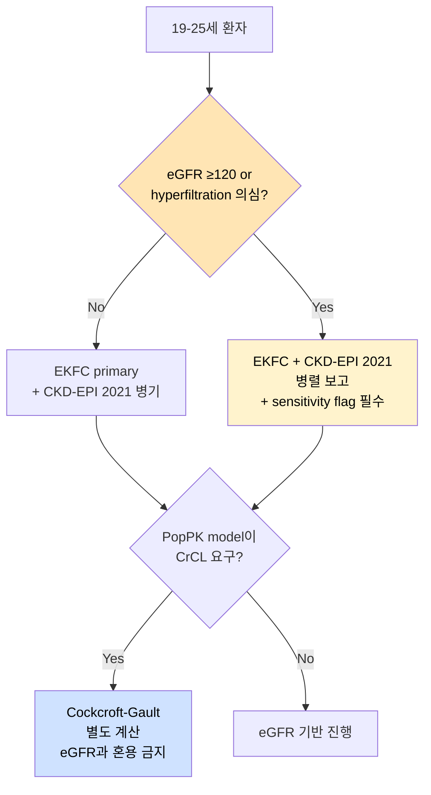

| 조건 | 기본값 | 보고 |
|---|---|---|
| 만 19–25세 일반 | EKFC primary | CKD-EPI 2021 병기 |
| eGFR ≥120 또는 hyperfiltration 의심 | EKFC + CKD-EPI 2021 병렬 | sensitivity flag 필수 |
| PopPK model이 CrCL 요구 | Cockcroft-Gault 별도 | eGFR과 혼용 금지 |
| 소아식 필요 | 🚫 launch core 제외 | v5.x |

---

## 9. Subgroup Pre-specification

### 9.1 Lock 시점 (v4.5.2 patch 반영)

> **Edge subgroup은 Gate P 승인 후, Gate T 진입 전에 lock한다.** PI가 프로젝트 위치와 utility focus를 조정할 수 있으므로, PI 동의 전 lock은 부적절.

### 9.2 기본 edge subgroup

| ID | Subgroup | 임상적 의미 |
|---|---|---|
| **SG1** | 고령 ≥75세 + eGFR <60 + BMI <20 | 저체중·노쇠·신기능 저하 tail |
| **SG2** | BMI ≥30 + eGFR <60 | 비만·신기능 저하 tail |
| **SG3** | eGFR ≥120 + 정상 체중 | hyperfiltration / ARC-like tail |
| **SG4** | 고령 ≥75세 + SCr low-normal + 저체중 | sarcopenic renal overestimation risk |
| **SG5** | AST/ALT elevated + low body size | hepatic-lab edge profile |

### 9.3 최소 표본수 규칙 (v4.5.2 patch)

| unweighted n | 판정 | Action |
|---|---|---|
| ≥50 | 🟢 분석 가능 | primary Gate D 판정에 사용 |
| 20–49 | 🟡 caution | bootstrap uncertainty 필수, 보조 판정 |
| <20 | 🔴 underpowered | descriptive-only, primary 판정 제외 |

---

## 10. Sampler Architecture + Vine Copula 정당화 (새로운 패치)

### 10.1 3-track sampler 동시 운영 (frozen)

| Track | 역할 | 비교 위치 |
|---|---|---|
| **Marginal-only** | naive baseline | "dependency 무시 시 어디까지 가능한가" |
| **Weighted empirical bootstrap** | model-free joint 보존 | copula의 honest comparator |
| **Survey-aware pseudo-population copula** | parametric joint 보존 | tail 외삽 가능, 재사용 가능한 generator |
| **MVN/nearPD** | comparison victim | method comparison 전용 (simulation input X) |

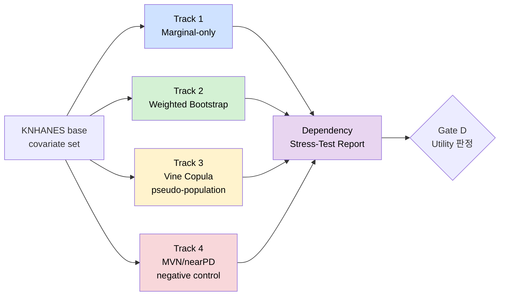

### 10.2 🔴 Methodological Justification for Vine Copula (v4.6 신규)

> **본 섹션은 reviewer가 "왜 bootstrap이 아니라 copula인가"를 첫 번째로 공격할 지점에 대한 사전 방어선이다.**

#### 정당화 3-line statement

> **(1)** KNHANES의 생리 공변량(age, SCr, weight 등)은 실제로 **비선형 의존 구조**를 가지며, 특히 tail에서 marginal 독립 가정과 elliptical (MVN) dependency 가정이 모두 깨진다.
>
> **(2)** Vine copula는 고차원 의존 구조를 **pair-copula decomposition**으로 분해하여 modeling하므로, MVN 기반 copula보다 **tail dependency와 비대칭 의존**을 더 유연하게 포착한다.
>
> **(3)** 따라서 vine copula는 본 데이터의 의존 구조를 보존하기 위한 **방법론적으로 정당한 선택**이며, weighted empirical bootstrap과 MVN을 comparator로 두어 **tail 외삽 가능성과 재사용 가능성이라는 vine copula 특유의 효용**을 실증적으로 검증한다.

#### Comparator design rationale

| 비교 차원 | Bootstrap이 우월한 영역 | Vine copula가 우월한 영역 |
|---|---|---|
| 관측 범위 내 sampling | ✅ honest, model-free | ✅ 동등 |
| 관측 범위 밖 tail 외삽 | ❌ 불가능 (resampling만 가능) | ✅ parametric tail extrapolation 가능 |
| Subgroup별 reweighting | 🟡 가능하나 sample 한계 | ✅ generator reuse 가능 |
| Reusability for downstream models | ❌ 매번 원자료 필요 | ✅ fitted object만으로 재생성 가능 |
| 해석 가능성 | ✅ 단순 | 🟡 pair-copula 구조 설명 필요 |
| 구현 난이도 | ✅ 낮음 | 🟡 중간 (`rvinecopulib` 의존) |

> 📌 **결론**: vine copula의 진짜 효용은 **"관측 범위 내 single-shot simulation"이 아니라 "관측 범위 밖 tail 외삽 + 재사용 가능한 generator"** 입니다. 이 점이 manuscript에서 가장 많이 공격받을 지점이고, comparator 디자인 자체가 이 정당화를 입증하는 구조입니다.

#### 재현성 sanity check

| Check | Pass 기준 |
|---|---|
| Pair-copula family 선택 | AIC/BIC 기반 자동 선택 + 수동 검증 |
| Tail dependence coefficient | 사전 가정 vs 실측 tail dependence 비교 |
| Inverse transform 정확도 | simulated marginal이 KNHANES weighted marginal과 일치 |
| Reproducibility | 동일 seed에서 동일 sample 재현 |

---

## 11. Adapter Layer + Sanity Check

### 11.1 Adapter 목적

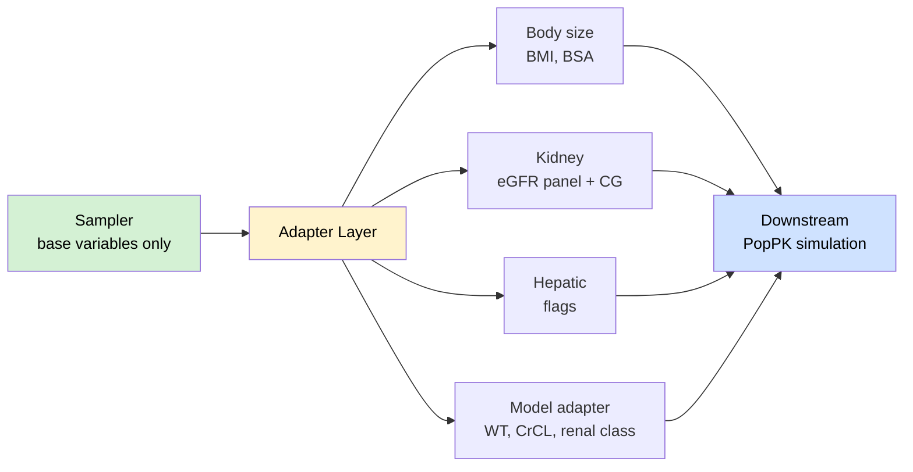

### 11.2 Adapter Sanity Check (D4–D14 build 단계)

| Check | Pass 기준 |
|---|---|
| BMI recalculation | KNHANES BMI vs 재계산 BMI median diff ≤ 0.1 kg/m² |
| BSA range | 1.2–2.5 m² 범위 외 자동 flag |
| eGFR panel | 4식 모두 계산 성공 (CKD-EPI 2009/2021, EKFC, Korean FAS) |
| CG CrCL | SCr 단위 검증 후 계산 |
| Renal class | KDIGO cutoff crossing rate (식 간 일치도) |
| Missing propagation | derived variable 결측 원인 추적 가능 |
| Unit audit | height cm/m, SCr mg/dL/µmol/L 혼동 없음 |

### 11.3 Clinical Plausibility Audit (v4.5.2 강화 → v4.6 유지)

> 🔑 **이 게이트가 본 프로젝트의 진짜 해자입니다.** 단순 joint sampler가 아니라 **임상적으로 말이 되는 가상환자 생성기**임을 입증하는 핵심 단계.

| Check | 의미 |
|---|---|
| 저체중 + 과도한 체표면적 조합 flag | 생리적 모순 탐지 |
| 초고령 + hyperfiltration + low SCr 조합 flag | 노쇠-신기능 모순 탐지 |
| Renal class와 age/SCr 일관성 | KDIGO 분류 합리성 |
| AST/ALT 극단치와 albumin 정상 조합 flag | 간기능 패턴 합리성 |

---

## 12. Benchmark Policy (Full Citations)

### 12.1 Claim boundary (재인용)

> 본 프로젝트는 임상 용량 권고 도구가 아니다. 반코마이신은 **신기능 민감 benchmark**로만 사용한다.

### 12.2 🔴 Reference models (v4.6 — shorthand 전면 제거, 실명 citation 삽입)

#### Primary reference model

> **Kim DJ, Lee DH, Ahn S, Jung J, Kiem S, Kim SW, Kim JY, Lee EJ, Lim Y, Kim S.** A new population pharmacokinetic model for vancomycin in patients with variable renal function: Therapeutic drug monitoring based on extended covariate model using CKD-EPI estimation. *J Clin Pharm Ther*. 2019;44(5):750–759. **doi:10.1111/jcpt.12995**. **PMID: 31228353**.

| 항목 | 값 |
|---|---|
| 구조모델 | 2-compartment, first-order elimination |
| 핵심 covariate | **CKD-EPI 기반 extended (time-varying) renal covariate on CL** |
| 데이터 | 99명 한국 성인, 328 vancomycin 농도, 광범위 신기능 범위 |
| 소프트웨어 | NONMEM 7.4 |
| **본 프로젝트 사용 이유** | **Korean adult vancomycin PopPK 중 가장 renal-function-sensitive한 모델. 시간 가변 renal covariate 구조가 본 simulation 목적과 정확히 일치** |
| 재현 목표 | 핵심 PK 파라미터 ±20% 이내 |

#### Fallback reference model (normal-renal-function anchor)

> **Kim YK, Kim D, Kang G, Zang DY, Lee DH.** Pharmacokinetics of vancomycin in healthy Korean volunteers and Monte Carlo simulations to explore optimal dosage regimens in patients with normal renal function. *Antibiotics (Basel)*. 2024;13(10):993. **doi:10.3390/antibiotics13100993**. **PMID: 39452259**. **PMCID: PMC11504268**.

| 항목 | 값 |
|---|---|
| 구조모델 | 2-compartment, first-order elimination |
| 핵심 covariate | **body weight + age on CL** (eGFR 미채택 — 정상 신기능 cohort) |
| 데이터 | 12명 건강 한국 성인 |
| Monte Carlo | 2,000 virtual subjects, AUC₂₄,ss 400–600 mg·h/L 목표 |
| **본 프로젝트 사용 위치** | **renal-function 'normal anchor' / sensitivity comparator 전용. Primary가 아님** |
| 한계 | 소표본(n=12), renal covariate 부재 → renal-sensitive utility는 Primary 모델 사용 |

> ⚠️ **주의**: v4.5.1 이전의 "Hong 2019 / Jeong 2024" shorthand는 v4.6에서 **전면 삭제**됨. 이 라벨은 PubMed/Wiley/MDPI에서 실명 검증 결과 **존재하지 않는 misattribution**으로 확인됨. (verification source: 첨부 문서 1 + 2026-04-25 web 재검증)

### 12.3 Benchmark fallback decision tree

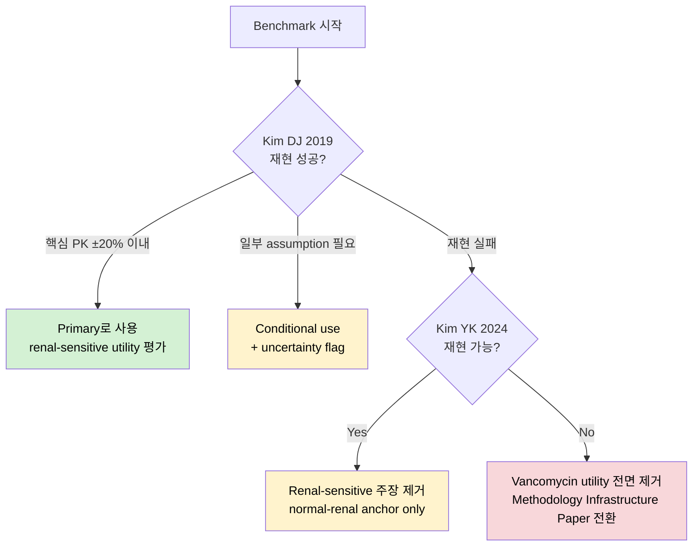

---

## 13. Gate D — Dependency Utility

### 13.1 효과크기 정의 (v4.5.2 patch 반영)

| 지표 | 정의 | 단위 |
|---|---|---|
| ΔPTA | absolute percentage-**point** difference | %p |
| Risk reclassification | absolute percentage-point difference | %p |
| Tail AUC shift | 사전 지정 percentile 또는 tail region의 **relative shift** | % |
| Median AUC shift | mg·h/L 단위 절대 변화 | mg·h/L |
| **Monte Carlo rule** | **fixed-seed 반복 simulation 또는 bootstrap uncertainty를 넘어서는 변화만 인정** | — |

### 13.2 판정 기준

| 결과 | 임계 (사전 지정 subgroup ≥1개에서) | Action |
|---|---|---|
| 🟢 **Strong signal** | ΔPTA ≥ 5%p **또는** risk reclass ≥ 5%p **또는** tail AUC shift ≥ 5% | **Full Build Go** |
| 🟡 **Weak but interpretable** | 2–5%p 변화, 방향성 일관 | **Conditional Build** + claim을 "edge-case sensitivity"로 축소 |
| 🔴 **Null signal** | 모든 subgroup에서 < 2%p 변화, MC error와 구별 불가 | **Full copula build STOP** |
| ⚫ **Unstable** | benchmark 재현 실패 또는 MC error 이하 | benchmark claim 제거, methodology paper 전환 |
| 🟤 **Underpowered** | subgroup unweighted n < 20 | descriptive-only, primary 판정 제외 |

### 13.3 Null result 공식 문구 (manuscript / IRB / README 동일 삽입)

> Gate D에서 사전 지정 edge subgroup 어느 곳에서도 dependency-driven shift (ΔPTA 또는 tail AUC ≥ 2%)가 확인되지 않으면 full vine-copula build를 중단한다. 이 결과는 실패가 아니라 **"KNHANES 성인 core phenotype layer에서는 dependency preservation이 해당 benchmark 결론을 실질적으로 바꾸지 않았다"는 negative utility evidence**로 재포지셔닝한다. 산출물은 Covariate Atlas, marginal/empirical bootstrap package skeleton, Dependency Stress-Test Report, methodological note로 축소한다.

> 🔴 **(v4.6 신규 — Gate P에서 PI 확인 필요)**: 이 시나리오에서 산출물 조합(Atlas + methodological note)이 **학위논문 1저자 챕터로 인정 가능한지**는 D-1 Gate P에서 PI에게 명시적으로 받아둔다.

---

## 14. Release Tier System

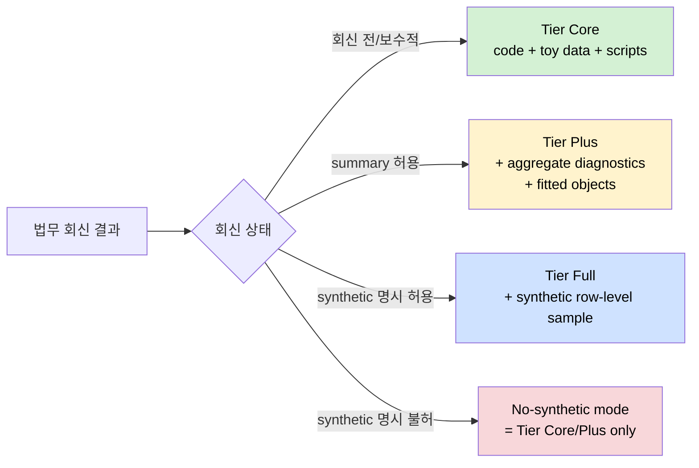

| Tier | 조건 | 공개물 |
|---|---|---|
| **Core (default)** | 법무 회신 전 또는 보수적 회신 | code, toy data, scripts, documentation, reproducibility dossier |
| **Plus** | summary/fitted object 허용 | + aggregate diagnostics, summary statistics, fitted objects |
| **Full** | synthetic row-level release **명시 허용** | + synthetic sample, extended tutorial |
| **No-synthetic** | synthetic 공개 불허 | code-only + Local Forge guide |

> 🔑 **원칙**: 법무 회신은 release tier만 결정하며, **프로젝트 존속과 무관**. Tier Core만으로도 Layer 1·2 효용은 모두 달성됨.

---

## 15. DMP & Privacy Firewall

### 15.1 DMP minimal statement (IRB 제출용)

> KNHANES raw files will be stored only in an encrypted local/project drive accessible to authorized project members within the PIPET laboratory. Raw KNHANES records and KNHANES-derived individual-level synthetic records will not be publicly released unless institutional legal clearance explicitly permits such release. Public artefacts will default to code, toy data, reproducibility scripts, aggregate diagnostics, fitted objects (when permitted), and documentation. No re-identification attempt will be made on the data.

### 15.2 Privacy Firewall metrics (synthetic 공개 검토 시)

| Metric | 목적 | 위반 시 |
|---|---|---|
| Duplicate rate | synthetic이 원자료 row 복제 여부 | No-synthetic mode |
| Nearest-neighbor distance | 원 KNHANES record와 과도하게 가까운 synthetic row 탐지 | Tier 1단계 강등 |
| Subgroup uniqueness (k-anonymity 유사) | 희귀 조합 재식별 위험 | minimum cell count 적용 |
| Outlier memorization | 극단값 외운 것인지 확인 | Tier 1단계 강등 |
| Minimum cell count | 작은 subgroup 공개 위험 제한 | 해당 subgroup 제외 |

---

## 16. Risk Register

| Risk | Probability | Impact | Mitigation | 발생 시 대응 |
|---|---|---|---|---|
| PI 방향 불일치 | 중 | 높 | Gate P | side / method note로 축소 |
| 기술 준비도 부족 | 중 | 높 | Gate T 7항목 | Caution mode (5일 rehearsal) |
| KNHANES 핵심 변수 부재 | 저–중 | 중 | codebook 사전 audit | scope 재정의 또는 cycle 병합 |
| Survey design 변수 사용 불가 | 저 | 높 | `survey` 패키지 사전 학습 | Stop, 데이터 출처 재확인 |
| **Vine copula 구현 실패** | **중** | **중** | **Gate T #5 신규** | **bootstrap을 primary로** |
| Kim DJ 2019 재현 실패 | 중 | 중 | fallback 명시 | Kim YK 2024로 anchor 전환 |
| Gate D null result | 중 | 중 | 공식 문구 + PhD 챕터 가치 PI 확인 | methodological note 전환 |
| Subgroup n 부족 | 중 | 중 | n rule (≥50/20–49/<20) | descriptive-only |
| 법무 synthetic 불허 | 높 | 저–중 | Tier Core default | Tier Core로 manuscript 제출 |
| Synthetic privacy 위반 | 저 | 중 | Privacy firewall metrics | No-synthetic mode |
| Target journal mismatch | 중 | 중 | Gate J 5분기 | branch별 저널 전환 |
| Overclaim | 저 | 높 | claim boundary 4곳 동일 삽입 | 즉시 표현 수정 |
| 일정 슬립 | 중 | 중 | 4주 사이클 압축 | scope 축소 |

---

## 17. Repository Structure

```text
/KoreanPKCov-Core/
├── README.md                          # claim boundary 삽입
├── LICENSE
├── ETHICS.md
├── DATA_POLICY.md
├── CLAIM_BOUNDARY.md                  # English + 한국어 동일 문구
├── CODEBOOK.md
├── raw/
│   └── .gitignore                     # 원자료는 절대 commit 금지
├── evidence/
│   ├── P0_one_page_PI_brief.pdf
│   ├── P0_PI_alignment_minutes.md     # null 시 챕터 가치 판단 (v4.6 신규)
│   ├── P0_decision.md
│   ├── P0_operator_readiness.md
│   ├── P0_subgroup_lock.md
│   ├── E2_irb_receipt.pdf
│   ├── E3_variable_availability_table.xlsx
│   ├── E5_legal_query.pdf
│   └── E5_legal_response.pdf
├── R/
│   ├── read_knhanes.R
│   ├── build_svy_design.R
│   ├── weighted_marginals.R
│   ├── bootstrap_sampler.R
│   ├── copula_sampler.R               # rvinecopulib 기반
│   ├── adapter_body_size.R
│   ├── adapter_egfr_panel.R
│   ├── adapter_model_formula.R
│   └── validation_checks.R
├── scripts/
│   ├── D0_variable_audit.R
│   ├── D1_weighted_summary.R
│   ├── D2_joint_vs_marginal.R
│   ├── D3_benchmark_mini_sim.R
│   └── D3_gate_decision.R
├── models/
│   ├── reference_model_KimDJ2019.cpp  # Primary (v4.6 실명)
│   └── reference_model_KimYK2024.cpp  # Fallback (v4.6 실명)
├── outputs/
│   ├── svy_design.rds
│   ├── weighted_marginals.html
│   ├── joint_vs_marginal_report.html
│   ├── benchmark_mini_simulation.html
│   ├── covariate_atlas.html
│   ├── dependency_stress_test_report.html
│   ├── model_readiness_index.csv
│   └── reproducibility_dossier.html
├── manuscript/
│   ├── manuscript_v4_6.qmd
│   ├── supplement.qmd
│   └── figures/
└── release/
    ├── tier_core/
    ├── tier_plus/
    └── tier_full_if_cleared/
```

---

## 18. Target Journal Branching

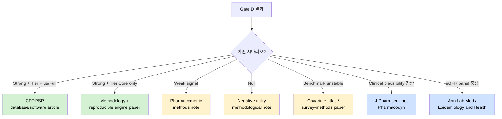

---

## 19. Model-Readiness Index

| Domain | 점수 |
|---|---|
| Covariate availability | 0–3 |
| Derivability | 0–3 |
| Clinical-context match | 0–3 |
| Legal release risk | 0–3 |
| Utility demonstration feasibility | 0–3 |

| Model | Readiness | Comment |
|---|---|---|
| Vancomycin (Kim DJ 2019) | **B** | WT/CrCL 가능, ICU/CRRT context mismatch |
| Metformin renal dosing | **B+** | renal covariates strong |
| DOAC renal dosing | **B** | age/weight/renal function useful |
| Tacrolimus CYP3A5 | **C** | genotype 없음, PGx module 필요 |
| Statin SLCO1B1 | **C** | genotype 없음, future PGx linkage 필요 |

---

## 20. Reviewer Attack Defense Map (v4.6 신규)

> 🔴 **본 섹션은 manuscript reviewer가 가장 먼저 공격할 5가지 지점에 대한 사전 방어선이다.**

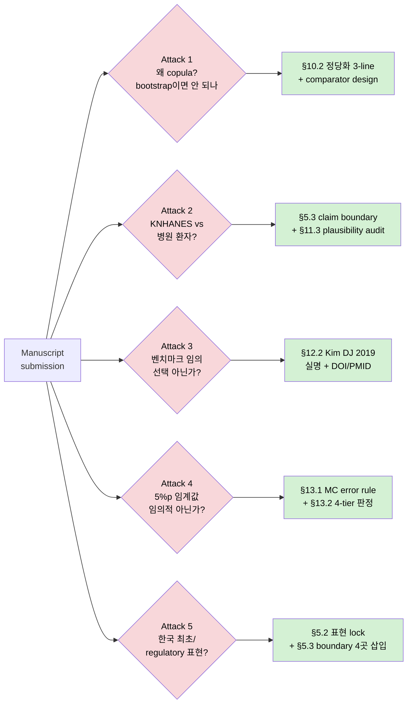

| # | 예상 공격 | 방어 위치 | 방어 요약 |
|---|---|---|---|
| 1 | "왜 vine copula? weighted bootstrap이면 충분하지 않나?" | §10.2 | bootstrap은 관측 범위 내 single-shot, vine copula는 tail 외삽 + 재사용 가능 generator. comparator design으로 효용 입증 |
| 2 | "KNHANES는 비입원 일반인구 자료인데, 병원 환자에 적용 가능한가?" | §5.3 + §11.3 | claim boundary로 임상 적용 차단. plausibility audit으로 cross-variable 합리성 검증 |
| 3 | "Kim DJ 2019 / Kim YK 2024 선택은 임의적 아닌가?" | §12.2 | Kim DJ 2019: Korean adult vancomycin PopPK 중 유일하게 CKD-EPI extended renal covariate 채택, renal-sensitive utility 목적과 정확히 일치. Kim YK 2024는 정상 신기능 anchor 전용 |
| 4 | "5%p, 2%p 임계값은 임의적 아닌가?" | §13.1 + §13.2 | absolute percentage-point 정의 + Monte Carlo error rule + 4-tier 판정 (strong/weak/null/unstable). MC error 초과만 인정 |
| 5 | "regulatory-grade, 한국 최초 같은 표현이 정당한가?" | §5.2 + §5.3 | 표현 lock 7가지 금지 + claim boundary 4곳 (manuscript/IRB/README/슬라이드 첫 장) 동일 삽입 |

---

## 21. Final Execution Decision

### 21.1 최종 실행 명령

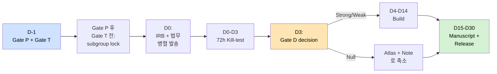

### 21.2 한 줄 판정

> **KoreanPKCov-Core v4.6은 "대형 DB 구축 계획"이 아니라, 72시간 안에 죽일 수 있는 핵심 가설을 먼저 검증하고, 살아남는 경우에만 survey-weighted Korean adult covariate engine으로 확장하는 PI-ready 실행 SOP이다. v4.6은 v4.5.3의 실행 구조에 vine copula 정당화, PhD 챕터 가치 명시 확인, benchmark 실명 citation, reviewer attack defense map만 패치한 미팅 직전본이다.**

### 21.3 지금 할 일 (D-1 출발선)

| 우선순위 | 작업 | 마감 |
|---|---|---|
| 1 | Appendix A 형태의 PI 1-page brief 출력 | D-1 미팅 전 |
| 2 | Gate T 7항목 체크리스트를 본인 기준으로 실제 점검 (특히 #5 vine copula) | D-1 |
| 3 | Edge subgroup 5개 후보를 PI 확인용으로 표시 | D-1 미팅 후 lock |
| 4 | D0–D3 kill-test script skeleton 작성 | Gate T 통과 직후 |
| 5 | IRB/DMP/legal query 문구를 v4.6 claim boundary에 맞게 수정 | D0 발송 직전 |

---

## Appendix A — PI 1-page Brief 복붙본

> **프로젝트명:** KoreanPKCov-Core
> **내부 전략 별칭:** Data Moat
>
> **한 줄 정의:** 공개 KNHANES 성인 자료 기반의 survey-weighted, dependency-preserving Korean pharmacometric covariate engine.
>
> **목적:** 한국인 PopPK/PK simulation에서 반복적으로 필요한 age, sex, body size, SCr/eGFR/CrCL, basic lab covariate의 결합분포를 재사용 가능한 형태로 구축하고, downstream model adapter를 통해 약물별 simulation readiness를 평가한다.
>
> **무엇이 아닌가:** 임상 용량 권고 도구가 아닙니다. 한국 최초 가상집단도 아닙니다 (SimCYP 한국 가상집단이 2019년에 이미 있습니다). regulatory-grade database도 아닙니다. 소아·PGx·biobank·EMR validation은 launch core에서 제외합니다.
>
> **72시간 kill-test:** KNHANES base covariate joint distribution이 marginal-only sampling 대비 사전 지정 edge subgroup에서 simulation output을 ΔPTA ≥ 5%p로 변화시키는지 확인합니다.
>
> **Reference benchmark (v4.6 실명):** Primary는 Kim DJ et al. (J Clin Pharm Ther 2019;44:750–759, doi:10.1111/jcpt.12995) — Korean adult variable-renal-function vancomycin PopPK with CKD-EPI extended covariate. Fallback은 Kim YK et al. (Antibiotics 2024;13:993, doi:10.3390/antibiotics13100993) — healthy Korean volunteer normal-renal-function anchor.
>
> **성공 시:** Local Forge package, Covariate Atlas, Dependency Stress-Test Report, Model-Readiness Index, renal-sensitive benchmark note로 확장합니다.
>
> **null result 시:** full copula build를 중단하고, "dependency preservation이 해당 benchmark 결론을 바꾸지 않았다"는 methodological note와 covariate atlas로 축소합니다.
>
> **PI께 요청드리는 결정 (3가지):**
> 1. 본 프로젝트를 학위논문 1저자 챕터, 방법론 예비연구, 사이드 프로젝트, 보류 중 어디에 둘지 결정해 주십시오.
> 2. 72시간 kill-test 진입 허가를 요청드립니다.
> 3. **Gate D null 결과물(Covariate Atlas + methodological note)이 학위논문 1저자 챕터로 인정 가능한지 명시적으로 확인해 주십시오.**

---

## Appendix B — D0–D3 Output Manifest

| 파일 | 형식 | 책임 Gate | 완료 기준 |
|---|---|---|---|
| `E3_variable_availability_table.xlsx` | xlsx | Gate A | core variable 존재, 결측률, 단위, cycle availability |
| `svy_design.rds` | RDS | Gate A | weight/strata/PSU 반영 design object 저장 |
| `S1_weighted_marginal_summary.html` | Quarto → HTML | Gate A | weighted marginal distribution report |
| `S2_joint_vs_marginal_mini_comparison.html` | Quarto → HTML | Gate D | 4-track 비교 (marginal/bootstrap/copula/MVN) |
| `S3_renal_sensitive_benchmark_mini_simulation.html` | Quarto → HTML | Gate C + D | Kim DJ 2019 mini-replication 결과 |
| `D3_gate_decision.md` | md | 종합 | Strong / Weak / Null / Unstable 중 하나 |
| `IRB_submission_receipt.pdf` | pdf | Gate B | 제출 증빙 |
| `Legal_query_sent.eml` | eml | Gate B | 법무 발송 기록 |

---

## Appendix C — v4.6 Change Log

| 변경 | 내용 | 버전 |
|---|---|---|
| Gate P 신설 | PI 정렬 사전 게이트 | v4.5.1 |
| Gate T 신설 | Operator readiness 6항목 | v4.5.1 |
| Gate D null 공식 문구 | methodological note 전환 lock | v4.5.1 |
| Kill threshold 수치화 | 5%p / 2%p | v4.5.1 |
| Edge subgroup pre-spec | 사후해석 차단 | v4.5.1 |
| Adapter sanity check | 단위 / 결측 / range 검증 | v4.5.1 |
| Claim boundary 4곳 삽입 | 영/한 동일 lock | v4.5.1 |
| DMP minimal statement | IRB 제출용 | v4.5.1 |
| Privacy firewall metrics | synthetic 공개 검토용 | v4.5.1 |
| Target journal reverse chaining | 5분기 | v4.5.1 |
| **Vine copula readiness** | **Gate T #5 신규** | **v4.5.2 → v4.5.3** |
| **Subgroup lock 시점** | **Gate P 후, Gate T 전** | **v4.5.2 → v4.5.3** |
| **19–25세 eGFR 정책** | **EKFC primary + CKD-EPI 2021 병기 + hyperfiltration flag** | **v4.5.2 → v4.5.3** |
| **Gate D 효과크기 정의** | **absolute %p + MC error rule** | **v4.5.2 → v4.5.3** |
| **Subgroup n rule** | **≥50 / 20–49 / <20** | **v4.5.2 → v4.5.3** |
| **Clinical plausibility audit** | **별도 gate로 격상** | **v4.5.3** |
| **🔴 Vine copula 이론적 정당화 섹션** | **§10.2 신설 (3-line statement + comparator design + sanity check)** | **v4.6 신규** |
| **🔴 Gate P 어젠다 #5** | **"Gate D null 결과물이 PhD 챕터로 인정 가능한지 명시 확인"** | **v4.6 신규** |
| **🔴 Benchmark 실명 citation** | **Kim DJ 2019 / Kim YK 2024 + DOI/PMID** | **v4.6 신규** |
| **🔴 Reviewer Attack Defense Map** | **§20 신설 (5대 공격 + 방어 위치 매핑)** | **v4.6 신규** |
| **🔴 Visual realignment** | **Mermaid flowchart 7개 + Gantt 1개** | **v4.6 신규** |
| 정체성 / Layer 구조 / scope lock / sampler 3-track / Tier system / 산출물 6종 | freeze 유지 | v4.5 → v4.6 |

---

## 🎯 한 줄 결론

> **v4.5.3은 freeze. v4.6은 vine copula 이론적 정당화, Gate D null 시 PhD 챕터 가치 PI 명시 확인, benchmark 실명 citation, reviewer attack defense map, mermaid 시각화만 추가. 이 상태에서 다음 친구 미팅에 본 문서를 들고 가 Gate P를 받고, Gate T를 통과하면 D0에 진입합니다.**

---

`C-260425-074512-K7P`
