# KoreanPKCov-Core v6.3 — PI-ready Full-Loop Final Launch Playbook

> **본 문서는 v6.2를 폐기하지 않는다.** v6.2의 핵심 골격인 **Artifact A 단독 생존, method tournament, Gate U-T/Gate C-D 분리, Open-Core 또는 reproducibility-audited release route, Gate P0→KT-24→KT-72 hard gate, 10주 Work Packet**은 유지한다.  
> v6.3은 여기에 (1) v4.6식 Table of Contents와 mermaid 시각화, (2) Skeleton/Stress/Execution Pass 통합, (3) Pre-P0 PI 이메일 게이트, (4) 6+2 adaptive variable core, (5) vine optional plugin 격하, (6) M0 generic simulator primary benchmark, (7) Gate C-D Figure 2 기본화, (8) external review 권장화, (9) reproducibility-audited default title route를 추가한 **PI-ready visual launch SOP**다.

> **최종 판정:** **Hard-Gated Go.** 단, 지금 하는 일은 10주 본실행이 아니라 **Pre-P0 + Gate P0 + KT-24 + KT-72 사살 테스트**다. D3에서 Go 또는 Caution이면 W1–W10 Work Packet으로 진입한다. Pivot이면 Artifact A-thesis route로 축소한다. No-Go이면 기술 실행을 중단하고 Telos를 재정의한다.

---

## 📑 Table of Contents

| § | Section | 핵심 내용 |
|---:|---|---|
| 0 | [문서의 성격](#0-문서의-성격) | v6.3은 v6.2 hard-gated SOP의 visual realignment + execution lock |
| 1 | [한 페이지 PI Brief](#1-한-페이지-pi-brief-executive-summary) | 지도교수께 보여드릴 1면 요약 |
| 2 | [v6.2 → v6.3 변경 요약](#2-v62--v63-변경-요약) | 무엇이 바뀌었고 무엇이 유지되는가 |
| 3 | [Full Loop 수행 기록](#3-full-loop-수행-기록-step-0-to-step-10) | T.E.A. Loop 0–10단계 전체 수행 결과 |
| 4 | [Skeleton → Stress → Execution 3-Pass 통합](#4-skeleton--stress--execution-3-pass-통합) | 세 pass의 판정과 v6.3 반영 |
| 5 | [거시 흐름도 + D3 Gate 구조](#5-거시-흐름도--d3-gate-구조) | 전체 decision architecture mermaid |
| 6 | [프로젝트 정체성 + Claim Boundary](#6-프로젝트-정체성--claim-boundary) | 무엇이라고 주장하고 무엇이라고 주장하지 않는가 |
| 7 | [Telos Lock + Proxy Evidence](#7-telos-lock--proxy-evidence) | 다섯 주체 판단 변화와 증거 파일 |
| 8 | [Entelechy: MVS-A/B + High-Quality](#8-entelechy-mvs-ab--high-quality) | thesis survival과 submission survival 분리 |
| 9 | [Value–Risk–Constraint Map](#9-valueriskconstraint-map) | Fatal/Major risk와 제약조건 |
| 10 | [Pre-D0 Gates: Pre-P0, P0, T](#10-pre-d0-gates-pre-p0-p0-t) | PI 정렬, operator readiness, 본실행 금지 조건 |
| 11 | [D0–D3 Kill-Test Protocol](#11-d0d3-kill-test-protocol) | KT-24/KT-72 사살 테스트 |
| 12 | [Scope Lock + 6+2 Adaptive Variable Core](#12-scope-lock--62-adaptive-variable-core) | 8변수 고정주의를 완화한 core/add-on 구조 |
| 13 | [Survey Design + Variable Manifest](#13-survey-design--variable-manifest) | survey-aware claim을 실제로 성립시키는 조건 |
| 14 | [Sampler Architecture + Method Tournament](#14-sampler-architecture--method-tournament) | engine 후보, tie-breaker, vine optional plugin |
| 15 | [nearPD / Copula Distortion Guard](#15-nearpd--copula-distortion-guard) | Gaussian/vine 후보의 왜곡 탐지 |
| 16 | [Adapter Layer + M0/M1 Benchmark Policy](#16-adapter-layer--m0m1-benchmark-policy) | M0 generic simulator primary, published model secondary |
| 17 | [Gate U-T + Gate C-D](#17-gate-u-t--gate-c-d) | utility와 distributional consequence 분리 |
| 18 | [Release Tier + Data Policy](#18-release-tier--data-policy) | Open-Core와 reproducibility-audited fallback |
| 19 | [DMP + Privacy Firewall](#19-dmp--privacy-firewall) | 원자료 비공개, 재현성 공개, privacy metrics |
| 20 | [10주 Work Packet Board](#20-10주-work-packet-board) | W1–W10 실행 계획 |
| 21 | [Leading Indicators + Intervention Rules](#21-leading-indicators--intervention-rules) | 20/40/60/80/90% 신호와 즉시 개입 |
| 22 | [Repository Structure](#22-repository-structure) | 폴더 트리와 산출물 위치 |
| 23 | [Reviewer Attack Defense Map](#23-reviewer-attack-defense-map) | 심사위원 공격과 방어선 |
| 24 | [Journal Route Branching](#24-journal-route-branching) | A1/A2/A3/B/C/D route |
| 25 | [Final QA + Go/No-Go Rubric](#25-final-qa--gonogo-rubric) | 제출 전 최종 체크리스트 |
| 26 | [Immediate Action List](#26-immediate-action-list) | 지금 바로 해야 할 일 |
| A | [Appendix A — v6.3 Rule Change Log](#appendix-a--v63-rule-change-log) | C6-31~C6-46 |
| B | [Appendix B — D0–D3 Output Manifest](#appendix-b--d0d3-output-manifest) | 72시간 산출물 체크리스트 |
| C | [Appendix C — PI 1-page Brief 복붙본](#appendix-c--pi-1-page-brief-복붙본) | 이메일/미팅용 복사본 |
| D | [Appendix D — D3 Gate Decision Template](#appendix-d--d3-gate-decision-template) | Go/Caution/Pivot/No-Go 템플릿 |
| E | [Appendix E — Metric Pre-registration Template](#appendix-e--metric-pre-registration-template) | U-T/C-D 사전등록 템플릿 |
| F | [Appendix F — Decision Log Seed Entries](#appendix-f--decision-log-seed-entries) | 시작 시 반드시 남길 결정 로그 |
| G | [Appendix G — Mermaid Diagram Index](#appendix-g--mermaid-diagram-index) | 그림 목록 |

---

## 0. 문서의 성격

```yaml
project: KoreanPKCov-Core
internal_strategic_alias: "Data Moat"
version: 6.3
status: "PI-ready, awaiting Pre-P0 / Gate P0 / KT-24 / KT-72"
revision_type: "Full Loop refinement + visual realignment + execution lock"
predecessor: v6.2
format_reference: v4.6
execution_rule: "No 10-week execution before D3 gate decision"
```

| 구분 | v6.3 결정 |
|---|---|
| **무엇이 바뀌었나** | v4.6식 TOC/그림 구조 도입, Skeleton/Stress/Execution Pass 통합, Pre-P0 이메일 gate 신설, 6+2 adaptive core 도입, vine optional plugin 격하, M0 primary benchmark 고정, Gate C-D Figure 2 기본화, external review 권장화, reproducibility-audited default route 도입 |
| **무엇이 유지되나** | Artifact A 단독 생존, method tournament, survey-aware covariate engine, Gate U-T/C-D 분리, MVS-A/B, D0–D3 사살 테스트, 10주 Work Packet, Decision Log, Claim Boundary |
| **이 문서의 운명** | 지도교수에게 PI Brief로 Gate P0를 받고, 통과 시 KT-24/KT-72를 수행한다. D3 전에는 본실행에 들어가지 않는다. |

---

## 1. 한 페이지 PI Brief (Executive Summary)

| 항목 | 내용 |
|---|---|
| **한 줄 정의** | 공개 KNHANES 26–79세 성인 자료를 기반으로 한국인 pharmacometric simulation에 재사용 가능한 **survey-aware adult covariate engine**을 만들고, 어떤 sampling method가 가장 현실적·재현성 있는지를 사전 지정 tournament로 결정하는 프로젝트입니다. |
| **핵심 목적** | PI·실행자·reviewer·연구실·외부 사용자가 “한국인 pharmacometric simulation의 현실성”을 이전과 다르게 판단하도록 만드는 것입니다. |
| **학위 챕터 생존 조건** | Target-specific utility가 null이어도, MVS-A(변수 manifest, survey design, 최소 1개 engine fidelity, plausibility, rebuildability, decision log, PI alignment)가 통과되면 Artifact A 단독 thesis chapter로 생존합니다. |
| **72시간 안에 죽일 가정** | PI가 Artifact A 단독 가치를 인정하는가, 6+2 variable core가 유지되는가, survey design object가 생성되는가, mini tournament에서 최소 1개 engine이 통과하는가, M0 benchmark가 작동하는가. |
| **가장 중요한 v6.3 변화** | D0 전에 Pre-P0 이메일로 PI alignment를 앞당기고, vine을 optional plugin으로 낮추며, M0 generic simulator를 primary benchmark로 고정합니다. |
| **무엇이 아닌가** | ❌ 임상 용량 권고 도구 ❌ regulatory-grade virtual population ❌ inpatient dosing cohort 대표 자료 ❌ 소아/PGx/biobank 통합 플랫폼 ❌ vine copula 증명 프로젝트 |
| **PI께 요청드리는 결정** | “Artifact A 단독—variable manifest, survey design, method tournament, validation, plausibility, rebuildability, decision log, manuscript shell—이 utility 결과와 무관하게 학위논문 1저자 핵심 챕터가 될 수 있는가?”에 대한 yes/conditional yes/no 판정입니다. |

---

## 2. v6.2 → v6.3 변경 요약

### 2.1 변경 흐름도

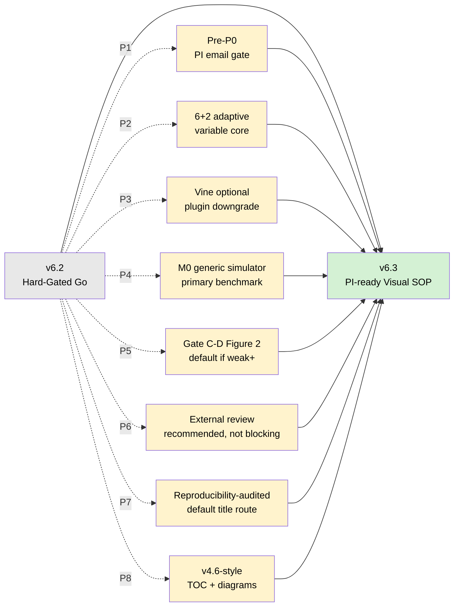

### 2.2 변경표

| 패치 | v6.2 상태 | v6.3 결정 | 이유 |
|---|---|---|---|
| **P1 Pre-P0** | Gate P0가 D0에 시작 | D-2~D0 pre-email로 PI alignment 선확인 | PI 불인정은 기술 테스트보다 먼저 죽여야 함 |
| **P2 6+2 adaptive core** | mandatory 8변수 중심 | Core-6 + Add-on-2로 분리 | AST/ALT/waist 이슈가 전체 엔진을 죽이지 않도록 함 |
| **P3 vine optional plugin** | KT-24-5로 강화되었으나 여전히 후보 존재감 큼 | optional plugin으로 격하, critical path 제외 | vine 실패가 프로젝트 실패로 오해되는 것 차단 |
| **P4 M0 primary** | M0 generic fallback | M0 generic simulator를 primary benchmark skeleton으로 고정 | published model port 지연을 줄임 |
| **P5 C-D Figure 2** | C-D는 consequence report | C-D weak+이면 Artifact A 기본 Figure 2 후보 | U-T null 시에도 시각적 main story 확보 |
| **P6 review rule** | external/internal fallback | external review는 권장, internal non-participant review면 Gate J 통과 가능 | W9 병목 차단 |
| **P7 title route** | Gate R fallback 존재 | Gate R 전 기본 title은 reproducibility-audited | Open-Core 과대 주장 방지 |
| **P8 visual playbook** | v6.2는 텍스트 중심 SOP | v4.6식 TOC, flowchart, gantt, decision map 삽입 | PI 미팅과 실행자 사용성 향상 |

### 2.3 v6.3 최종 판정표

| 축 | 평가 항목 | 점수 | 판정 |
|---|---|---:|---|
| A1 | Telos 명확성 | 9.0 / 10 | ✅ |
| A2 | 학위 챕터 생존성 | 8.8 / 10 | ✅ |
| A3 | 방법론 방어력 | 8.6 / 10 | ✅ |
| A4 | 실행 현실성 | 8.3 / 10 | ✅ |
| A5 | 리스크 차단력 | 9.0 / 10 | ✅ |
| A6 | 논문화 가능성 | 8.2 / 10 | ✅ |
| A7 | 일정 현실성 | 8.0 / 10 | ✅ |
| **종합** |  | **8.6 / 10** | **Hard-Gated Go** |

---

## 3. Full Loop 수행 기록 — Step 0 to Step 10

### 3.1 Full Loop Route

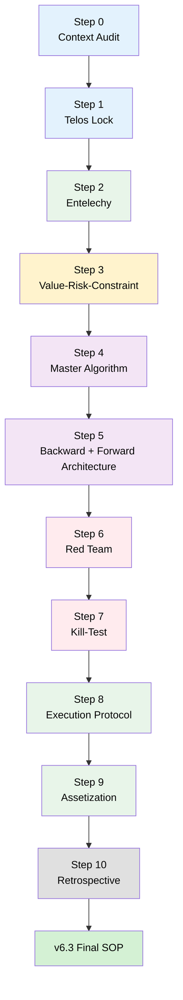

### 3.2 Step Contract Strip — 전체 11단계

| Step | 질문 | v6.3 결정 | 증거 | 다음 행동 |
|---|---|---|---|---|
| **0 Context Audit** | 지금 문제는 신규 설계인가, 실행 전 정제인가? | 실행 전 정제다. v6.2 골격은 유지한다. | v6.2는 이미 Hard-Gated Go이며 Skeleton/Stress/Execution Pass가 본실행 전 사살 테스트를 지지한다. | D3 전 본실행 금지 문구를 문서 전반에 반복 삽입 |
| **1 Telos Lock** | 성공하면 누가 무엇을 다르게 판단하는가? | PI·실행자·reviewer·연구실·외부 사용자의 판단 변화로 잠근다. | Proxy Evidence Table을 MVS-A/B와 연결한다. | Pre-P0 brief에 proxy evidence table 삽입 |
| **2 Entelechy** | 어떤 관찰 가능한 증거가 있으면 성공인가? | MVS-A(thesis survival), MVS-B(submission survival), HQ package로 3층화한다. | v6.2 MVS-A/B를 유지하되 M7 PI alignment를 명시한다. | dashboard 파일 생성 |
| **3 Value–Risk–Constraint** | 무엇이 죽이면 즉시 멈추는가? | PI 불인정, core variable 붕괴, survey-aware 실패, 0 engine fidelity, proxy evidence 공백이 fatal이다. | Stress Pass의 5개 Fatal risk를 본문 §9로 이동한다. | fatal 조건을 D3 template에 강제 |
| **4 Master Algorithm** | 장인은 어떤 규칙으로 선택하는가? | “가장 정교한 모델”이 아니라 “가장 안정적·설명 가능·재현 가능·survey design을 덜 훼손하는 엔진”을 고른다. | tie-breaker: survey-native → fidelity → plausibility → simplicity → runtime → releaseability. | tournament scoring table 생성 |
| **5 Backward + Forward Architecture** | 최종 산출물에서 역산하면 오늘 무엇부터 해야 하는가? | Pre-P0 → KT-24 → KT-72 → D3 decision → W1–W10이다. | Execution Pass의 Phase 0/1/2 board를 v6.3로 정리한다. | D0–D3 output manifest 작성 |
| **6 Red Teaming** | 가장 위험한 반론은 무엇인가? | “survey-aware가 아니다”, “분포 차이는 당연하다”, “5%p가 임의적이다”, “open claim 과장이다”가 핵심이다. | Reviewer Attack Defense Map을 별도 섹션화한다. | claim boundary 파일을 먼저 생성 |
| **7 Kill-Test** | 24–72시간 안에 무엇을 죽일 수 있는가? | PI alignment, variable core, survey design, mini engine, M0 benchmark, vine optional feasibility, nearPD guard를 죽인다. | KT-24/KT-72 protocol을 §11에 구체화한다. | `KT24_summary.md`, `D3_gate_decision.md` 작성 |
| **8 Execution Protocol** | 실행 중 무엇을 감시할 것인가? | W2/W4/W6/W8/W9 leading indicator와 intervention rule을 고정한다. | Execution Pass의 20/40/60/80/90% dashboard를 유지한다. | W6 manuscript shell 없으면 분석 금지 |
| **9 Assetization** | 결과를 어떻게 재사용 자산으로 남길 것인가? | tier_core/reproducibility-audited release, prompt library, decision log, manuscript shell, metric preregistration을 남긴다. | v6.2 repository tree를 v6.3로 보완한다. | repo skeleton 생성 |
| **10 Retrospective** | 다음 버전에 무엇을 남길 것인가? | C6-31~C6-46 rule change를 확정한다. | Execution Pass의 v6.3 후보 rules를 본문화한다. | D3/Week4/W8/W10에 retrospective trigger |

---

## 4. Skeleton → Stress → Execution 3-Pass 통합

### 4.1 3-Pass 요약

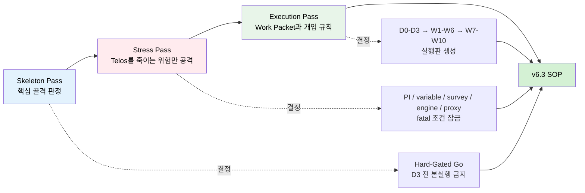

| Pass | 목적 | 최종 판정 | v6.3 반영 |
|---|---|---|---|
| **Skeleton Pass** | 전체 구조가 살아 있는지 빠르게 판단 | Hard-Gated Go. D3 전 본실행 금지. | §5 D3 Gate 구조, §10 Pre-D0 Gates |
| **Stress Pass** | Telos를 죽일 수 있는 fatal/major risk만 공격 | PI 불인정, variable/survey/engine 붕괴, proxy 공백이면 실행 금지 | §9 Risk Map, §23 Defense Map |
| **Execution Pass** | D0–D3, W1–W6, W7–W10 실행판 작성 | 실행 가능. 단 D3 통과 전 본실행 금지. | §20 Work Packet, §21 Leading Indicators |

### 4.2 3-Pass Stage Contract

**결정:** v6.3은 Full Loop 산출물이지만, 실제 운영은 Skeleton→Stress→Execution 순서로 압축 점검한다.  
**증거:** Skeleton은 Hard-Gated Go를, Stress는 fatal 조건을, Execution은 work packet과 intervention rule을 제공한다.  
**다음 행동:** D0 시작 전 `skeleton_stress_execution_summary.md`를 생성하고, D3 Gate에서 세 pass가 모두 통과되었는지 확인한다.

---

## 5. 거시 흐름도 + D3 Gate 구조

### 5.1 전체 흐름도

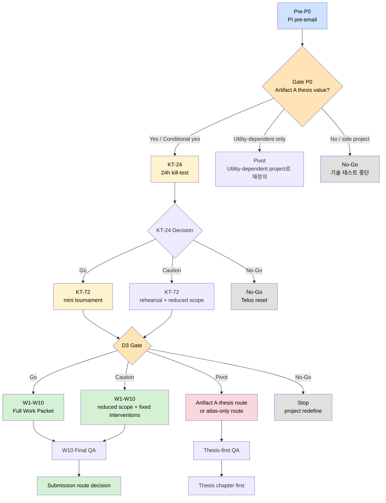

### 5.2 v6.3 Gantt 타임라인

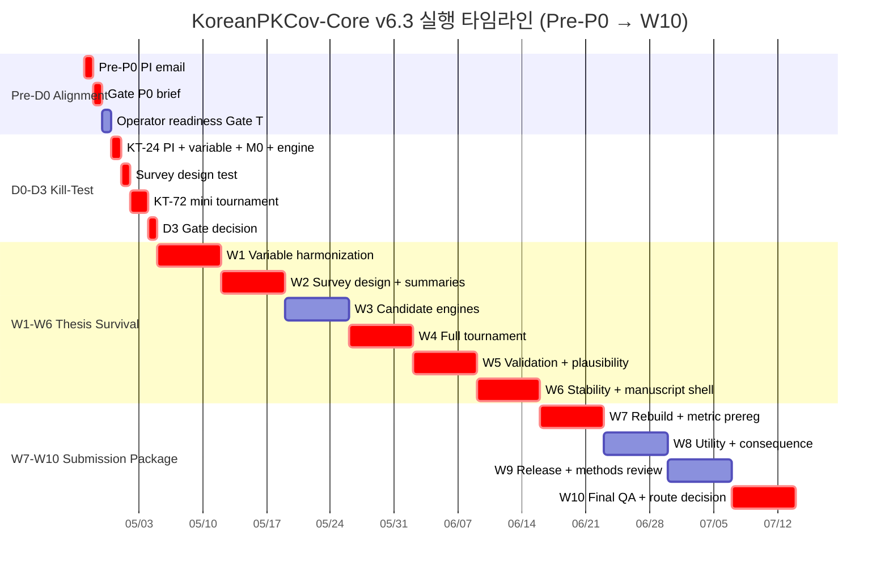

### 5.3 D3 Gate 판정표

| D3 판정 | 조건 | 다음 행동 |
|---|---|---|
| **Go** | PI yes/conditional yes + core variable 통과 + survey design 생성 + mini tournament ≥1 engine pass + M0 benchmark 작동 | W1–W10 full Work Packet 진입 |
| **Caution** | PI conditional yes + 1–2개 technical caution이나 thesis route 유지 가능 | W1–W10 reduced scope, W2/W4/W6 강제 재판정 |
| **Pivot** | PI가 utility-dependent 답변, mini tournament 0 pass, 또는 survey-aware claim 약화 | Artifact A-thesis route / atlas-only route / non-survey route 중 하나로 축소 |
| **No-Go** | PI가 side project로 판정하거나 core variable과 survey/engine이 동시에 붕괴 | 기술 실행 중단, Telos 재정의 |

---

## 6. 프로젝트 정체성 + Claim Boundary

### 6.1 Identity Freeze

| 항목 | v6.3 lock |
|---|---|
| **정체성** | 공개 KNHANES 기반 survey-aware adult covariate engine + method tournament + reproducibility package |
| **핵심 산출물** | Artifact A: engine/validation/rebuildability/manuscript shell |
| **보조 산출물** | Artifact B: target-specific utility, Artifact C: distributional consequence |
| **주요 사용자** | PI, 실행자, reviewer, PIPET 연구실, 외부 독자/사용자 |
| **핵심 방어선** | U-T/C-D가 null이어도 MVS-A가 통과되면 thesis-safe Artifact A가 생존 |

### 6.2 Claim Boundary — 사용 가능한 표현

| Claim level | 허용 표현 | 금지 표현 |
|---|---|---|
| **Core claim** | “reproducibility-audited survey-aware Korean adult covariate engine” | “validated Korean virtual population” |
| **Data claim** | “based on public KNHANES adult survey data” | “represents Korean inpatient patients” |
| **Method claim** | “method tournament selected the most stable candidate under pre-specified criteria” | “vine copula is the best method” |
| **Utility claim** | “target-specific utility was evaluated conditionally” | “improves clinical dosing decisions” |
| **Consequence claim** | “preserving dependence changed simulation input distribution” | “distributional difference proves clinical utility” |
| **Release claim** | Gate R 전: “reproducibility-audited” / Gate R 후: “open-core rebuildable” | raw KNHANES row-level data 공개 암시 |

### 6.3 Abstract에 반드시 들어갈 안전 문장

> This engine is intended to support pharmacometric simulation design and methodological evaluation, not to provide patient-level dosing recommendations or to replace disease-specific clinical cohorts.

---

## 7. Telos Lock + Proxy Evidence

### 7.1 Final Telos v6.3

> **KoreanPKCov-Core v6.3의 목적은 공개 KNHANES 26–79세 성인 자료를 사용하여, PI·실행자·reviewer·연구실·외부 사용자가 한국인 pharmacometric simulation의 현실성에 대해 시작 전과 다르게 판단하도록 만드는 것이다. 그 수단은 survey-aware adult covariate engine, 사전 지정 method tournament, 재현 가능한 release package, target-specific utility와 distributional consequence를 분리한 검증 프레임, 그리고 실행 중 drift를 차단하는 Decision Log다.**

### 7.2 판단 변화 대상과 proxy evidence

| 주체 | 시작 전 판단 | 종료 후 목표 판단 | proxy evidence | 산출물 |
|---|---|---|---|---|
| **PI** | Artifact A 단독 챕터 가치 불확실 | utility 결과와 무관하게 학위 챕터 가능 | yes/conditional yes 문구 | `P0_pre_alignment_note.md` |
| **실행자** | vine 또는 특정 모델을 입증해야 함 | pre-specified tournament가 winner를 고른다 | 기각/선택 사유 기록 | `decision_log.md` |
| **Reviewer** | 또 하나의 virtual population | survey-aware, rebuildable, claim-bounded method asset | claim boundary + rebuild + review note | `CLAIM_BOUNDARY.md`, `rebuild_log.txt`, `internal_methods_review.md` |
| **연구실** | 매번 covariate prior를 새로 만듦 | adapter와 tier_core를 lab OS로 재사용 | adapter test | `adapter_test_report.html` |
| **외부 사용자** | marginal-only simulation을 무비판적으로 사용 | dependence preservation이 input과 일부 output을 어떻게 바꾸는지 확인 | toy run + Figure 2 | `README.md`, `figure_input_distortion.html` |

### 7.3 Telos achievement bundle

```text
/telos_evidence/
├── P0_pre_alignment_note.md
├── decision_log.md
├── CLAIM_BOUNDARY.md
├── rebuild_log.txt
├── internal_methods_review.md
├── adapter_test_report.html
├── README_toy_run_check.md
└── figure_input_distortion.html
```

**Stage Contract — Telos**  
**결정:** v6.3 Telos는 “엔진을 만든다”가 아니라 “판단이 바뀐다”로 잠근다.  
**증거:** 각 판단 주체별 proxy evidence와 파일이 정의되어 있다.  
**다음 행동:** Pre-P0 이메일에 PI proxy 문구를 먼저 확보한다.

---

## 8. Entelechy: MVS-A/B + High-Quality

### 8.1 Survival Architecture

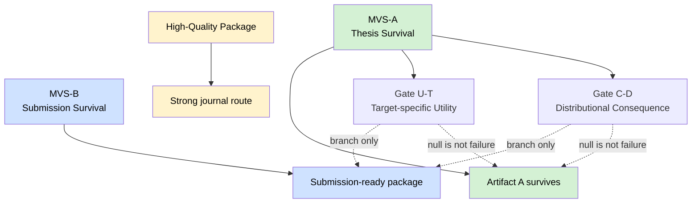

### 8.2 MVS-A — Thesis Survival

MVS-A가 통과되면 Gate U-T/C-D가 null이어도 프로젝트는 thesis-safe Artifact A로 생존한다.

| ID | 조건 | 증거 파일 | 통과 기준 |
|---|---|---|---|
| **M1 Variable core** | 6+2 variable core의 가용성/단위/결측 코드 정리 | `variable_availability_table.xlsx` | Core-6 모두 통과, Add-on-2는 pass 또는 documented downgrade |
| **M2 Survey design** | survey design object와 weighted summaries 생성 | `survey_summary.html`, `svy_design.rds` | 주요 변수 weighted summary 재현 가능 |
| **M3 Engine fidelity** | mini 또는 full tournament에서 ≥1 engine pass | `engine_validation_report.html` | weighted mean/quantile/dependence fidelity 기준 충족 |
| **M4 Plausibility** | impossible value 0건 | `plausibility_audit_report.html` | impossible 0, implausible rate documented |
| **M5 Rebuildability** | clean-machine 또는 clean-session rebuild | `rebuild_log.txt`, `hash_policy.md` | core output 재생성 가능 |
| **M6 Decision Log** | 하지 않은 결정 ≥5개 기록 | `decision_log.md` | Non-goals, rejected methods, claim limits 포함 |
| **M7 PI alignment** | Artifact A 단독 챕터 인정 | `P0_pre_alignment_note.md` | yes 또는 conditional yes |

### 8.3 MVS-B — Submission Survival

| ID | 조건 | 증거 파일 | 통과 기준 |
|---|---|---|---|
| **S1 Stability** | 50–100 seed stability 또는 축소판 stability | `stability_report.html` | crash 0 또는 documented acceptable failure |
| **S2 Manuscript shell** | W6까지 Methods/Results shell 존재 | `manuscript_A_shell.qmd` | figure/table placeholder 포함 |
| **S3 Metric preregistration** | U-T/C-D metric 및 MC/bootstrap rule 사전 등록 | `metric_pre_registration.md` | threshold + uncertainty rule 명시 |
| **S4 Release package** | tier_core 또는 reproducibility-audited package | `/release/tier_core/` 또는 `/release/repro_audited/` | README, toy data, notebook, expected hash |
| **S5 Methods review** | external 또는 internal non-participant review | `internal_methods_review.md` 또는 `external_methods_review.md` | major issue triaged |
| **S6 Route decision** | journal/thesis route 확정 | `journal_route_decision.md` | A1/A2/A3/B/C/D 중 하나 |

### 8.4 High-Quality Package

| HQ | 조건 | 의미 |
|---|---|---|
| **H1** | MVS-A/B 모두 통과 | thesis + submission survival |
| **H2** | Gate C-D weak+ 또는 Gate U-T weak+ | Figure-based story 확보 |
| **H3** | internal non-participant가 30분 내 README toy run 성공 | 외부 재현성 방어 |
| **H4** | reviewer attack defense map이 manuscript Discussion과 연결 | 심사 대응 가능 |
| **H5** | W10 시점에 abstract/title route가 Gate R 결과에 맞게 선택 | overclaim 방지 |

---

## 9. Value–Risk–Constraint Map

### 9.1 Fatal Risk Map

| Fatal risk | 죽는 이유 | 판정 규칙 | v6.3 차단 장치 |
|---|---|---|---|
| **F1 PI가 Artifact A 단독 가치를 부정** | thesis-safe core가 무너짐 | No-Go / Telos reset | Pre-P0 + Gate P0 |
| **F2 Core-6 변수 붕괴** | engine 자체가 성립하지 않음 | Core-6 중 ≥2개 붕괴 시 No-Go/Pivot | 6+2 adaptive core |
| **F3 survey-aware 구조 실패** | title-level claim 붕괴 | survey design object 실패 시 non-survey route | Survey design gate |
| **F4 mini/full tournament 0 pass** | “사용 가능한 엔진”이 없음 | KT-72 Pivot, W4 atlas-only | mini tournament |
| **F5 proxy evidence 공백** | Telos가 수사로 남음 | Gate P/Manuscript route 보류 | Telos evidence bundle |

### 9.2 Major Risk Map

| Major risk | 공격 논리 | v6.3 방어 |
|---|---|---|
| **M1 Gate C-D tautology** | dependence-preserving과 marginal-only가 다른 건 당연하다 | utility 금지, input distortion/consequence로만 표현 |
| **M2 ΔPTA 5%p 임의성** | effect size threshold가 임의적이다 | model-specific MC uncertainty + exploratory label |
| **M3 nearPD 왜곡** | Gaussian candidate가 원 correlation을 변형한다 | distortion guard로 E2 downgrade |
| **M4 mrgsolve/published model 실패** | utility layer가 지연된다 | M0 generic simulator primary |
| **M5 Open-Core claim 제한** | legal/IRB 회신 지연 | default title은 reproducibility-audited |
| **M6 W8–W9 병목** | 분석은 되지만 글이 안 나온다 | W6 manuscript shell rule |
| **M7 external reviewer 미응답** | submission 지연 | internal non-participant review로 대체 가능 |
| **M8 scope creep** | 소아/PGx/biobank/transition zone 재등장 | Non-goals 재인쇄 + Decision Log |

### 9.3 Constraint Lock

| 제약 | v6.3 운영 규칙 |
|---|---|
| 시간 | D3 전 본실행 금지, W6 shell rule, W10 route decision |
| 법무/IRB | Gate R 전 Open-Core claim 금지, raw row-level data 공개 금지 |
| 방법론 | 특정 엔진 선험화 금지, tournament winner만 본문 중심 |
| 논문 | utility null은 실패가 아님, Artifact A가 main story |
| 범위 | 26–79세 adult core, pediatric/PGx/biobank/inpatient dosing claim 제외 |

---

## 10. Pre-D0 Gates: Pre-P0, P0, T

### 10.1 Gate 구조

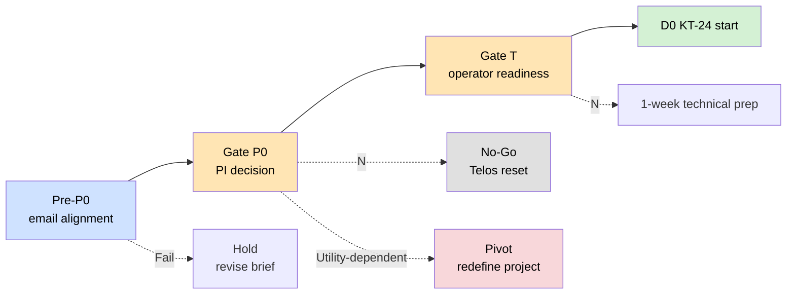

### 10.2 Pre-P0 — v6.3 신설

| 항목 | 내용 |
|---|---|
| **목적** | PI가 미팅 전 Artifact A 단독 thesis value를 이해하도록 1-page brief를 먼저 보냄 |
| **산출물** | `P0_pre_alignment_email.md`, `P0_pre_alignment_note.md` |
| **질문** | “Utility 결과가 null이어도 Artifact A가 학위논문 1저자 챕터로 인정 가능한가?” |
| **통과** | yes 또는 conditional yes |
| **실패** | side project 또는 utility-dependent only → 기술 테스트 중단/재정의 |

### 10.3 Gate P0 — PI Alignment

| 판정 | 의미 | 행동 |
|---|---|---|
| **Yes** | Artifact A 단독 thesis value 인정 | KT-24 시작 |
| **Conditional yes** | 조건부 인정 | 조건을 D3 Gate에 명시하고 KT-24 시작 |
| **Utility-dependent** | U-T 결과가 있어야 인정 | Pivot: utility-dependent project로 재정의하거나 Artifact A thesis value 재설득 |
| **No** | side project 또는 가치 부족 | No-Go, 기술 테스트 중단 |

### 10.4 Gate T — Operator Readiness

| 항목 | Pass 기준 |
|---|---|
| R 환경 | `survey`, `dplyr`, `data.table`, `mrgsolve` 또는 M0 simulator 실행 가능 |
| KNHANES access | raw/data dictionary 접근 경로 확인 |
| Repository | skeleton folder 생성 가능 |
| Engine prototype | marginal/bootstrap/Gaussian/vine optional 중 최소 3개 toy 출력 가능 |
| Writing system | `manuscript_A_shell.qmd` 생성 준비 |
| Decision log | `decision_log.md` 템플릿 준비 |

---

## 11. D0–D3 Kill-Test Protocol

### 11.1 KT-24 — 가장 싼 파괴

| ID | 테스트 | 산출물 | Pass | Fail/Pivot |
|---|---|---|---|---|
| **KT-24-1 PI alignment** | Gate P0 문구 확보 | `P0_pre_alignment_note.md` | yes/conditional yes | No면 즉시 중단 |
| **KT-24-2 6+2 variable audit** | core variable 가용성/단위 rough audit | `E1_variable_availability_table_v0.xlsx` | Core-6 pass | Core-6 ≥2개 붕괴 시 No-Go/Pivot |
| **KT-24-3 subgroup n** | edge subgroup rough n 확인 | `subgroup_n_rough.md` | ≥1 subgroup n≥50 | descriptive-only |
| **KT-24-4 M0 benchmark** | generic simulator toy run | `toy_M0_run_log.txt` | run success | utility layer 보류 |
| **KT-24-5 engine toy** | ≥3 engine common schema output | `toy_engine_schema_log.txt` | ≥3 output | 후보 축소 |
| **KT-24-6 optional vine** | KNHANES-like weighted subset에서 vine feasibility | `toy_vine_survey_weighted_log.txt` | success or documented fail | fail이면 vine optional 제거, 프로젝트는 생존 |
| **KT-24-7 nearPD guard** | Gaussian nearPD correction check | `nearPD_distortion_v0.md` | no major inversion | E2 downgrade |

### 11.2 KT-72 — 실제 data subset mini tournament

| ID | 테스트 | 산출물 | Pass | Fail/Pivot |
|---|---|---|---|---|
| **KT-72-1 survey design** | `svydesign` object 생성 | `svy_design_test.rds` | object + weighted summary | non-survey route |
| **KT-72-2 mini tournament** | 3–5 variable subset으로 engine 비교 | `mini_tournament_report.html` | ≥1 engine pass | atlas-only Pivot |
| **KT-72-3 plausibility** | impossible value check | `plausibility_v0.html` | impossible 0 | rule patch |
| **KT-72-4 M0 adapter** | covariate output → M0 연결 | `adapter_M0_test_log.txt` | success | utility branch 보류 |
| **KT-72-5 D3 decision** | Go/Caution/Pivot/No-Go 판정 | `D3_gate_decision.md` | 단일 판정 | 판정 불가 시 본실행 금지 |

### 11.3 D3 Decision Tree

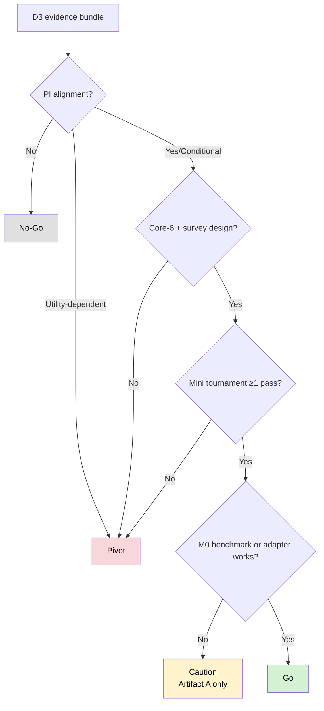

---

## 12. Scope Lock + 6+2 Adaptive Variable Core

### 12.1 Launch scope

| 범위 | v6.3 lock |
|---|---|
| Population | KNHANES public adult data, age 26–79 |
| Primary use | pharmacometric simulation covariate prior / method asset |
| Primary output | survey-aware adult covariate engine |
| Excluded | pediatric, pregnancy, PGx, biobank, inpatient EHR linkage, direct dosing recommendation |

### 12.2 6+2 Adaptive Core

v6.2의 mandatory 8변수는 명확했지만, 실제 harmonization에서 AST/ALT/waist가 반복적으로 흔들릴 경우 전체 프로젝트를 죽일 수 있다. v6.3은 이를 다음처럼 분리한다.

| Layer | 변수 | 역할 | 붕괴 시 조치 |
|---|---|---|---|
| **Core-6** | age, sex, height, weight, waist, SCr | adult physiologic covariate engine의 최소 본체 | Core-6 중 1개 문제는 patch, ≥2개 붕괴는 Pivot/No-Go |
| **Add-on-2** | AST, ALT | hepatic/lab plausibility add-on | 둘 중 하나 이상 문제 시 add-on downgrade 가능 |
| **Derived** | BMI, eGFR panel, CG CrCL | adapter layer 산출 | base variable audit 후 생성 |

**중요:** Add-on-2가 downgrade되어도 Artifact A가 자동 사망하지 않는다. 단, hepatic plausibility claim은 축소한다.

### 12.3 eGFR / renal policy

| 항목 | v6.3 결정 |
|---|---|
| Primary renal metric | EKFC 또는 프로젝트 내부에서 사전 지정한 adult-compatible equation |
| Comparator | CKD-EPI 2021, CG CrCL legacy comparator |
| 19–25세 | launch core에서 제외. transition zone은 future/supplement에도 기본적으로 넣지 않음 |
| Renal-sensitive claim | SCr/eGFR audit가 통과된 경우에만 사용 |

---

## 13. Survey Design + Variable Manifest

### 13.1 survey-aware claim의 최소 조건

| 조건 | 산출물 | 실패 시 |
|---|---|---|
| survey design object 생성 | `svy_design.rds` | survey-aware title claim 보류 |
| weighted marginal summary 재현 | `survey_summary.html` | cycle/weight 처리 재검토 |
| hold-out split 정책 | `holdout_policy.md` | tournament 해석 보류 |
| missingness / unit / assay table | `variable_availability_table.xlsx` | variable core 축소 |
| weight-aware validation | `tournament_comparison_table.html` | non-survey route 또는 atlas-only |

### 13.2 Variable Manifest 항목

| Column | 설명 |
|---|---|
| variable_name | 원 변수명 |
| harmonized_name | 분석 변수명 |
| cycle | KNHANES cycle |
| availability | 가용 여부 |
| unit | 단위 |
| missing_code | 결측 코드 |
| assay_note | assay/측정 방식 note |
| transform_rule | 변환 규칙 |
| core_layer | Core-6 / Add-on-2 / Derived |
| failure_action | 붕괴 시 조치 |

---

## 14. Sampler Architecture + Method Tournament

### 14.1 후보 엔진

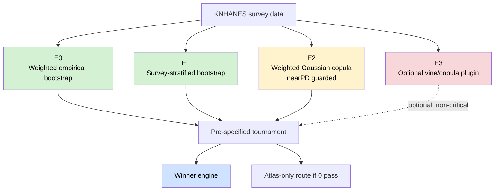

### 14.2 v6.3 engine policy

| Engine | 지위 | 이유 |
|---|---|---|
| **E0 Weighted empirical bootstrap** | 기본 후보 | 가장 단순하고 survey design 훼손이 적음 |
| **E1 Survey-stratified bootstrap** | 기본 후보 | strata/cluster 구조 보존 가능성 |
| **E2 Gaussian copula** | 조건부 후보 | dependence modeling 가능하나 nearPD guard 필요 |
| **E3 Vine/copula plugin** | optional plugin | 실패해도 프로젝트 생존. critical path에서 제외 |

### 14.3 Tournament scoring

| Metric family | 지표 | 기본 통과 기준 |
|---|---|---|
| Marginal fidelity | weighted mean, SD, P10/P50/P90 | mean 차이 ≤5%, quantile 차이 ≤10%p 또는 사전 지정 기준 |
| Dependence fidelity | Kendall τ / Spearman ρ rank | top-pair rank inversion 없음 또는 documented |
| Plausibility | impossible/implausible combinations | impossible 0건 |
| Stability | seed crash, runtime variation | crash 0 또는 documented acceptable failure |
| Rebuildability | clean-session output hash | expected hash 또는 tolerance match |
| Simplicity | hyperparameter count, dependency burden | tie-breaker에서 단순 후보 우선 |

### 14.4 Tie-breaker

1. survey design을 가장 덜 훼손하는 후보  
2. hold-out fidelity가 더 좋은 후보  
3. impossible value가 적은 후보  
4. hyperparameter와 외부 의존성이 적은 후보  
5. runtime과 rebuildability가 더 안정적인 후보  
6. 여전히 동률이면 **가장 단순한 후보**  

**규칙:** “더 정교한 후보”가 아니라 “충분히 정확하고 더 방어 가능한 후보”가 이긴다.

---

## 15. nearPD / Copula Distortion Guard

### 15.1 왜 필요한가

Gaussian copula나 high-dimensional correlation 기반 후보는 positive-definite 보정을 거치면서 원자료의 dependence structure를 바꿀 수 있다. v6.3은 이를 단순 경고가 아니라 engine downgrade 조건으로 둔다.

### 15.2 Distortion Guard

| Guard | 지표 | 경고 | 조치 |
|---|---|---|---|
| **G1 correction norm** | Frobenius norm of correction | 사전 지정 threshold 초과 | E2 downgrade |
| **G2 eigenvalue correction** | negative eigenvalue magnitude | 보정량 과다 | E2 sensitivity-only |
| **G3 top-pair inversion** | top 5 dependence pairs rank inversion | ≥2개 inversion | E2 본문 winner 금지 |
| **G4 biological pair distortion** | SCr-age, weight-height, AST-ALT 관계 | 방향성 반전 | E2 제거 |
| **G5 runtime instability** | seed별 fit/runtime variation | >3배 | E2/E3 downgrade |

---

## 16. Adapter Layer + M0/M1 Benchmark Policy

### 16.1 Adapter architecture

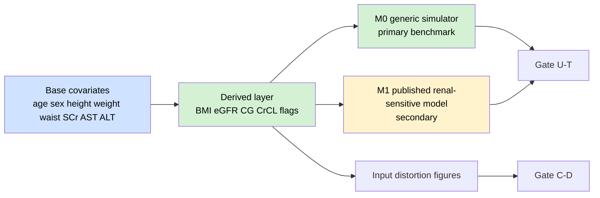

### 16.2 M0 primary benchmark — v6.3 고정

| 항목 | 결정 |
|---|---|
| **M0 지위** | primary benchmark skeleton |
| **목적** | 특정 published model port 실패가 utility/consequence evaluation 전체를 지연시키지 않게 함 |
| **내용** | renal-sensitive 또는 covariate-sensitive generic exposure/risk simulator |
| **산출물** | `toy_M0_run_log.txt`, `adapter_M0_test_log.txt`, `utility_report_target_M0.html` |
| **해석** | clinical utility가 아니라 method sensitivity demonstration |

### 16.3 M1/M2 published benchmark

| 항목 | 결정 |
|---|---|
| **M1/M2 지위** | secondary / opportunistic benchmark |
| **실패 시** | Artifact A 생존에 영향 없음 |
| **성공 시** | Gate U-T의 clinical/model-specific utility 강화 |
| **W8 이전 미완료 시** | supplement 또는 future validation으로 격하 |

---

## 17. Gate U-T + Gate C-D

### 17.1 Gate taxonomy

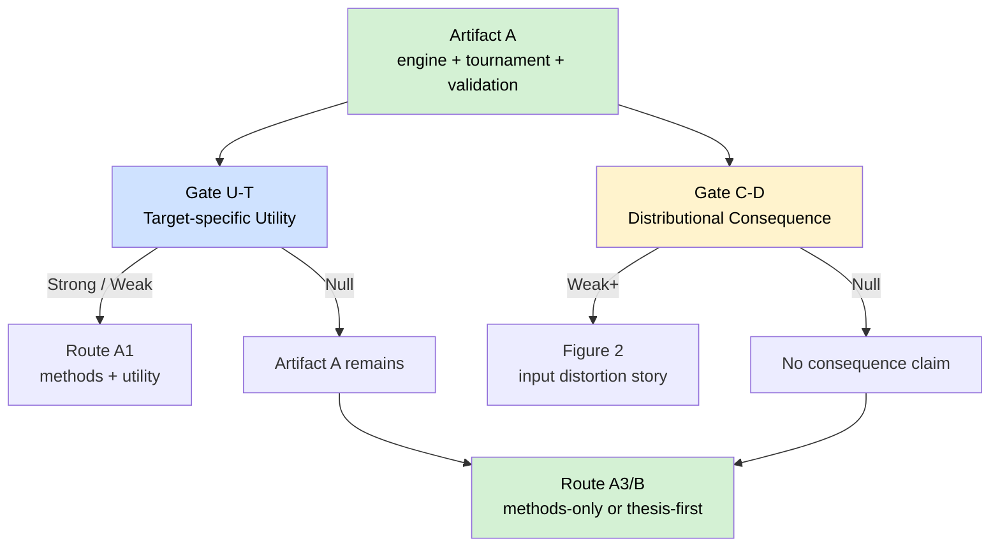

### 17.2 Gate U-T — Target-specific Utility

| 판정 | 조건 | 표현 |
|---|---|---|
| **Strong** | ΔPTA, risk reclassification, tail AUC shift 중 ≥1개가 사전 지정 threshold와 MC uncertainty rule을 통과 | “target-specific simulation output was meaningfully altered” |
| **Weak** | effect direction은 일관되나 MC uncertainty 또는 threshold 근거가 약함 | “suggestive model-specific effect” |
| **Null** | effect가 작거나 불확실 | “no target-specific utility signal in this benchmark” |
| **Exploratory** | threshold 사전 근거가 약하거나 model port 제한 | supplement/exploratory only |

### 17.3 Gate C-D — Distributional Consequence

| 판정 | 조건 | 표현 |
|---|---|---|
| **Strong** | marginal-only 대비 input distribution/tail/dependence distortion이 사전 지정 threshold 통과 | “input distribution was materially distorted by marginal-only sampling” |
| **Weak** | 일부 변수쌍 또는 subgroup에서만 distortion | “localized distributional consequence” |
| **Null** | meaningful distortion 없음 | “no material input distortion detected” |

**금지:** Gate C-D를 standalone clinical utility로 부르지 않는다.

### 17.4 Figure policy

| 조건 | Figure 배치 |
|---|---|
| Gate U-T weak+ | Figure 2 또는 3: target-specific output shift |
| Gate U-T null + Gate C-D weak+ | **Figure 2: input distortion / consequence** |
| 둘 다 null | Figure 2는 tournament/validation figure로 전환 |

---

## 18. Release Tier + Data Policy

### 18.1 Release route

| Route | 조건 | Title/claim |
|---|---|---|
| **Tier Core Open-Core** | Gate R 통과, raw row-level data 미포함, toy data/rebuild notebook 공개 가능 | “open-core rebuildable” |
| **Reproducibility-audited** | Gate R 불명확 또는 legal/IRB 제한 | **default route before Gate R** |
| **Internal-only** | 공개 제한 강함 | thesis/manuscript는 재현 절차만 설명 |

### 18.2 v6.3 title route

| Gate R 상태 | 제목 후보 |
|---|---|
| Gate R pass | “An Open-Core, Survey-Aware Korean Adult Covariate Engine for Pharmacometric Simulation” |
| Gate R pending/limited | “A Reproducibility-Audited Survey-Aware Korean Adult Covariate Engine for Pharmacometric Simulation” |
| Gate R fail | “A Survey-Aware Korean Adult Covariate Engine: Methods, Validation, and Reproducibility Audit” |

### 18.3 Release package contents

```text
/release/
├── tier_core/                 # Gate R pass 시
│   ├── README.md
│   ├── toy_data.csv
│   ├── rebuild_notebook.qmd
│   ├── expected_hashes.json
│   └── sessionInfo.txt
└── repro_audited/             # Gate R pending/limited 시 default
    ├── README.md
    ├── toy_data.csv
    ├── audit_protocol.md
    ├── expected_outputs/
    └── sessionInfo.txt
```

---

## 19. DMP + Privacy Firewall

| 원칙 | v6.3 규칙 |
|---|---|
| Raw data | KNHANES row-level raw data를 repository에 포함하지 않음 |
| Toy data | synthetic/toy data만 공개 |
| Rebuild | 사용자가 직접 공개 포털에서 데이터를 받아 재생성하도록 안내 |
| Hash | output hash 또는 tolerance-based hash policy 명시 |
| Privacy metrics | exact row replication, nearest-neighbor risk, rare cell rule 점검 |
| Legal ambiguity | Gate R 전 Open-Core 표현 금지 |

---

## 20. 10주 Work Packet Board

### 20.1 Phase 0 — D0–D3 사살 테스트

| WP | 기간 | 목표 | 산출물 | 통과 기준 | 실패 시 |
|---|---|---|---|---|---|
| **WP-00 Pre-P0/Gate P0** | D-2–D0 | PI thesis alignment | `P0_pre_alignment_note.md` | yes/conditional yes | No-Go/Telos reset |
| **WP-01 KT-24** | D0–D1 | 24h fatal assumptions kill | `KT24_summary.md` | PI yes + Core-6 + M0 + ≥3 engine toy | fail 시 중단/축소 |
| **WP-02 KT-72** | D1–D3 | survey subset mini tournament | `mini_tournament_report.html` | survey design + ≥1 engine pass | atlas-only Pivot |
| **WP-03 D3 Decision** | D3 | 단일 판정 | `D3_gate_decision.md` | Go/Caution/Pivot/No-Go | 판정 불가 시 본실행 금지 |

### 20.2 Phase 1 — W1–W6 Artifact A thesis survival

| WP | 기간 | 목표 | 산출물 | 통과 기준 | 실패 시 |
|---|---|---|---|---|---|
| **WP-04 Variable Harmonization** | W1 | 6+2 core audit | `variable_availability_table.xlsx` | Core-6 pass | 6변수 재설계/Pivot |
| **WP-05 Survey Design** | W2 | survey design + weighted summaries | `survey_summary.html`, `svy_design.rds` | 주요 summary 재현 | survey-aware claim 보류 |
| **WP-06 Candidate Engines** | W3 | output schema 통일 | `candidate_output_schema.md` | ≥3 engine schema | 후보 축소 |
| **WP-07 Full Tournament** | W4 | tournament 실행 | `tournament_comparison_table.html` | ≥1 pass | atlas-only Pivot |
| **WP-08 Validation/Plausibility** | W5 | winner validation | `engine_validation_report.html`, `plausibility_audit_report.html` | impossible 0 | biological patch |
| **WP-09 Stability + Manuscript Shell** | W6 | stability + manuscript shell | `stability_report.html`, `manuscript_A_shell.qmd` | shell 존재 | 분석 추가 금지 |

### 20.3 Phase 2 — W7–W10 submission/release branch

| WP | 기간 | 목표 | 산출물 | 통과 기준 | 실패 시 |
|---|---|---|---|---|---|
| **WP-10 Rebuildability** | W7 | clean-session rebuild | `rebuild_log.txt`, `hash_policy.md` | core output 재생성 | release claim 축소 |
| **WP-11 Metric preregistration** | W7 | U-T/C-D metric lock | `metric_pre_registration.md` | threshold + MC rule | exploratory 격하 |
| **WP-12 Utility/Consequence** | W8 | U-T/C-D 평가 | `utility_report_target.html`, `consequence_report_distributional.html` | branch 판정 | A 유지 |
| **WP-13 Release Packaging** | W9 | tier/repro package | `/release/tier_core/` 또는 `/release/repro_audited/` | README + toy + hash | title fallback |
| **WP-14 Methods Review** | W9 | internal/external review | `internal_methods_review.md` | major triaged | submission sprint |
| **WP-15 Final QA** | W10 | route decision | `submission_packet_checklist.md`, `journal_route_decision.md` | route A1–D 확정 | 1주 sprint |

---

## 21. Leading Indicators + Intervention Rules

| 지점 | 정상 신호 | 위험 신호 | 개입 규칙 |
|---|---|---|---|
| **20% / W2** | variable manifest + survey summary 존재 | Core-6 붕괴, survey design 실패 | scope 축소, Gate P 재확인 |
| **40% / W4** | tournament table 존재, ≥1 engine pass | 0 pass, schema 불일치 | atlas-only Pivot 준비 |
| **60% / W6** | validation + manuscript shell 존재 | shell 없음, stability 미착수 | **분석 추가 금지**, writing sprint |
| **80% / W8** | rebuild + U-T/C-D reports 존재 | U-T 과몰입, release 지연 | Artifact A main route 고정 |
| **90% / W9** | release package + review note 존재 | external 무응답, Gate R 불명확 | internal review, reproducibility-audited route |

### 21.1 즉시 개입 규칙

| 위험 신호 | 즉시 판정 | 개입 |
|---|---|---|
| PI가 Artifact A 단독 가치를 부정 | No-Go | 기술 테스트 중단 |
| PI가 utility-dependent 답변 | Pivot | utility-dependent project 또는 Artifact A 재설득 |
| Core-6 중 ≥2개 붕괴 | Pivot/No-Go | 6변수 재설계 또는 scope reset |
| survey design object 실패 | Major | survey-aware claim 보류 |
| mini/full tournament 0 pass | Pivot | atlas-only route |
| impossible value >0 | Major | biological rule patch |
| nearPD distortion 과대 | Major | Gaussian downgrade |
| vine crash | Minor-to-Major | vine plugin 제거 |
| U-T null | Not failure | Artifact A 유지 |
| C-D null | Not failure | input distortion claim 삭제 |
| W6 manuscript shell 없음 | Major schedule risk | 분석 freeze |
| Gate R 불명확 | Claim risk | reproducibility-audited route |
| external reviewer 무응답 | Non-blocking | internal review 대체 |

---

## 22. Repository Structure

```text
/KoreanPKCov-Core/
├── README.md
├── CLAIM_BOUNDARY.md
├── ETHICS.md
├── DATA_POLICY.md
├── CODEBOOK.md
├── decision_log.md
├── metric_pre_registration.md
├── hash_policy.md
├── P0_pre_alignment_email.md
├── P0_pre_alignment_note.md
├── demand_signal.md
├── skeleton_stress_execution_summary.md
├── /data_manifest/
│   ├── variable_availability_table.xlsx
│   ├── variable_harmonization_report.html
│   └── 6plus2_core_policy.md
├── /R/
│   ├── 00_setup.R
│   ├── 01_load_knhanes.R
│   ├── 02_survey_design.R
│   ├── 03_candidate_engines.R
│   ├── 04_tournament_metrics.R
│   ├── 05_plausibility_audit.R
│   ├── 06_stability.R
│   ├── 07_rebuild_check.R
│   ├── 08_utility_consequence.R
│   └── 09_M0_generic_simulator.R
├── /evidence/
│   ├── KT24_summary.md
│   ├── D3_gate_decision.md
│   ├── toy_M0_run_log.txt
│   ├── toy_engine_schema_log.txt
│   ├── toy_vine_survey_weighted_log.txt
│   ├── mini_tournament_report.html
│   ├── nearPD_distortion_report.html
│   ├── tournament_comparison_table.html
│   ├── engine_validation_report.html
│   ├── plausibility_audit_report.html
│   ├── stability_report.html
│   ├── rebuild_log.txt
│   ├── utility_report_target.html
│   ├── consequence_report_distributional.html
│   ├── figure_input_distortion.html
│   └── adapter_test_report.html
├── /release/
│   ├── tier_core/
│   │   ├── README.md
│   │   ├── toy_data.csv
│   │   ├── rebuild_notebook.qmd
│   │   ├── expected_hashes.json
│   │   └── sessionInfo.txt
│   └── repro_audited/
│       ├── README.md
│       ├── toy_data.csv
│       ├── audit_protocol.md
│       └── expected_outputs/
└── /manuscript/
    ├── manuscript_A_shell.qmd
    ├── manuscript_A_draft.qmd
    ├── methodological_note_draft.qmd
    ├── reviewer_defense_map.md
    ├── internal_methods_review.md
    ├── external_methods_review.md
    ├── submission_packet_checklist.md
    └── journal_route_decision.md
```

---

## 23. Reviewer Attack Defense Map

| Reviewer attack | 위험 | v6.3 defense | 위치 |
|---|---|---|---|
| “KNHANES는 inpatient data가 아니다” | external validity 공격 | physiologic background prior이지 inpatient cohort가 아님을 명시 | Claim Boundary, Discussion |
| “survey-aware라고 하지만 실제로는 일반 bootstrap 아닌가?” | title-level claim 붕괴 | survey design object, weighted summaries, weight-aware validation 제시 | Methods, Supplement |
| “분포가 다른 건 당연하다” | C-D tautology 공격 | C-D를 utility가 아니라 input distortion evidence로만 표현 | Results/Discussion |
| “5%p가 왜 의미 있나?” | U-T threshold 공격 | model-specific MC uncertainty, exploratory label, sensitivity | Metric preregistration |
| “왜 vine인가?” | 방법 선험화 공격 | vine은 optional plugin, tournament loser면 제거 | Methods |
| “nearPD가 상관구조를 왜곡했다” | Gaussian validity 공격 | distortion guard, top-pair inversion report | Supplement |
| “open claim이 과장됐다” | legal/release 공격 | Gate R 전 reproducibility-audited default title | Title/Abstract |
| “외부 검토가 부족하다” | credibility 공격 | internal non-participant review + clean rebuild | Gate J |
| “negative result 아닌가?” | null utility 공격 | Artifact A는 U-T/C-D와 독립 생존 | Discussion |
| “scope가 너무 넓다” | overreach 공격 | 26–79 adult core, no dosing recommendation, no PGx/biobank | Scope Lock |

---

## 24. Journal Route Branching

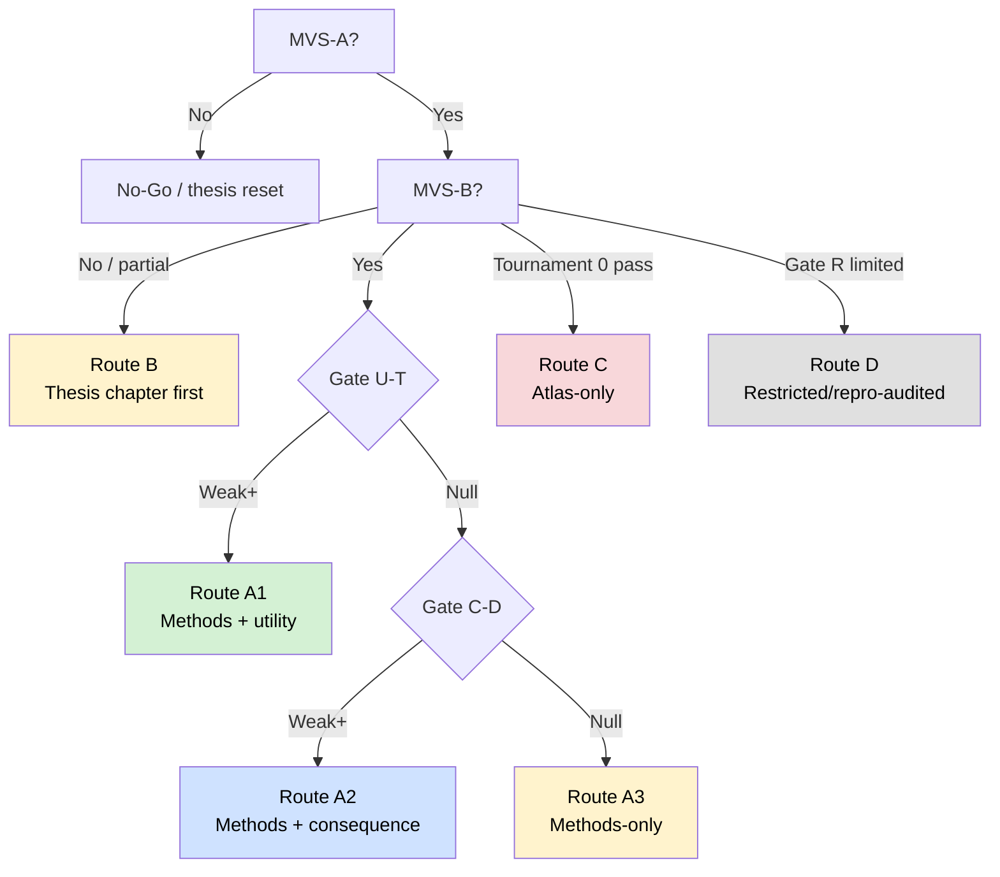

| Route | 조건 | 저널/산출 방향 |
|---|---|---|
| **A1 — full methods + utility** | MVS-A/B + Gate U-T weak+ | CPT:PSP full article 후보 |
| **A2 — methods + consequence** | MVS-A/B + Gate C-D weak+, U-T null | CPT:PSP/JCPT methods focus |
| **A3 — methods only** | MVS-A/B, U-T/C-D null | methodological note, reproducibility paper |
| **B — thesis chapter first** | MVS-A 통과, MVS-B 일부 지연 | 학위 챕터 우선, journal later |
| **C — atlas-only** | tournament 0 pass but PI thesis value 유지 | covariate atlas + limitations note |
| **D — restricted/repro-audited** | Gate R 제한 | non-open reproducibility-audited route |

---

## 25. Final QA + Go/No-Go Rubric

### 25.1 QA checklist

| # | QA 항목 | Pass 기준 |
|---:|---|---|
| 1 | PI Artifact A 인정 문구 확보 | `P0_pre_alignment_note.md` yes/conditional yes |
| 2 | Telos proxy evidence 존재 | 5주체 proxy 중 PI/실행자/reviewer 필수 |
| 3 | MVS-A dashboard 존재 | M1–M7 상태 표시 |
| 4 | 6+2 core policy 존재 | `6plus2_core_policy.md` |
| 5 | survey design object 생성 | `svy_design.rds` |
| 6 | tournament ≥1 engine pass | `tournament_comparison_table.html` |
| 7 | impossible value 0 | `plausibility_audit_report.html` |
| 8 | nearPD guard 수행 | `nearPD_distortion_report.html` |
| 9 | M0 adapter 또는 simulator 작동 | `toy_M0_run_log.txt` |
| 10 | W6 manuscript shell 존재 | `manuscript_A_shell.qmd` |
| 11 | metric preregistration 존재 | `metric_pre_registration.md` |
| 12 | release route 확정 | tier_core 또는 repro_audited |
| 13 | review note 존재 | internal 또는 external |
| 14 | route decision 확정 | A1/A2/A3/B/C/D |
| 15 | Claim Boundary 위반 0건 | abstract/title/discussion 점검 |

### 25.2 Go/No-Go rubric

| 판정 | 조건 |
|---|---|
| **Go** | Gate P0 yes/conditional yes + KT-72 ≥1 engine pass + MVS-A 달성 가능 + W6 shell rule 수용 |
| **Caution** | technical issue 1–2개 있으나 MVS-A 생존 가능 |
| **Pivot** | utility-dependent PI 답변, survey-aware 약화, 0 engine pass, Add-on collapse |
| **No-Go** | PI가 Artifact A 단독 가치를 부정하거나 Core-6/survey/engine이 동시에 붕괴 |

---

## 26. Immediate Action List

| 순서 | 행동 | 산출물 | 제한 시간 |
|---:|---|---|---|
| 1 | Pre-P0 PI email 작성 | `P0_pre_alignment_email.md` | 즉시 |
| 2 | PI brief 1장 생성 | `P0_pre_alignment_note.md` | D0 전 |
| 3 | repo skeleton 생성 | `/KoreanPKCov-Core/` | D0 전 |
| 4 | decision log seed 5개 작성 | `decision_log.md` | D0 전 |
| 5 | 6+2 core policy 작성 | `6plus2_core_policy.md` | KT-24 전 |
| 6 | KT-24 script scaffold 작성 | `KT24_summary.md` | D0 |
| 7 | M0 generic simulator toy run | `toy_M0_run_log.txt` | D0–D1 |
| 8 | survey design test | `svy_design_test.rds` | D1–D2 |
| 9 | mini tournament | `mini_tournament_report.html` | D2–D3 |
| 10 | D3 decision | `D3_gate_decision.md` | D3 |

---

# Appendix A — v6.3 Rule Change Log

| Rule | 변경 | 이유 |
|---|---|---|
| **C6-31** | PI alignment를 D0 이전 Pre-P0 이메일로 당김 | PI 불인정은 기술 테스트보다 먼저 죽여야 함 |
| **C6-32** | 8변수 mandatory 대신 6+2 adaptive core 도입 | AST/ALT/waist 이슈가 전체 엔진을 죽이지 않도록 함 |
| **C6-33** | vine candidate를 optional plugin으로 격하 | vine 실패를 project failure로 오해하지 않게 함 |
| **C6-34** | M0 generic simulator를 primary benchmark skeleton으로 고정 | published model port 지연 차단 |
| **C6-35** | Gate C-D weak+이면 Figure 2 후보로 고정 | U-T null 시에도 Artifact A 시각 story 확보 |
| **C6-36** | external review를 필수에서 권장으로 격하 | W9 bottleneck 제거 |
| **C6-37** | Gate R 전 기본 title route를 reproducibility-audited로 설정 | Open-Core 과대 claim 방지 |
| **C6-38** | W6 manuscript shell 없으면 분석 추가 금지 | 분석 과잉과 writing delay 차단 |
| **C6-39** | C-D에서 utility 단어 사용 금지 | tautology 공격 방지 |
| **C6-40** | nearPD top-pair inversion guard를 E2 downgrade 조건으로 설정 | Gaussian distortion 공격 차단 |
| **C6-41** | PI/실행자/reviewer proxy evidence를 MVS-A 필수 요소로 반영 | Telos를 검증 가능한 형태로 유지 |
| **C6-42** | D3 decision 없이는 W1 진입 금지 | hard-gated Go 유지 |
| **C6-43** | internal non-participant review로 Gate J 통과 가능 | 외부 reviewer SLA 비현실성 제거 |
| **C6-44** | Add-on-2 failure는 hepatic claim downgrade로 처리 | core engine 생존성 보장 |
| **C6-45** | M0 결과는 clinical utility가 아니라 method sensitivity로 표현 | 과대해석 방지 |
| **C6-46** | D3, W4, W8, W10에 Retrospective trigger 자동 발동 | drift 조기 수정 |

---

# Appendix B — D0–D3 Output Manifest

| 파일 | 필수 여부 | 생성 시점 | 설명 |
|---|---|---|---|
| `P0_pre_alignment_email.md` | 필수 | Pre-D0 | PI에게 보낼 사전 정렬 이메일 |
| `P0_pre_alignment_note.md` | 필수 | D0 | PI yes/conditional yes 기록 |
| `KT24_summary.md` | 필수 | D1 | 24h 사살 테스트 요약 |
| `E1_variable_availability_table_v0.xlsx` | 필수 | D1 | 6+2 variable rough audit |
| `subgroup_n_rough.md` | 필수 | D1 | subgroup rough n |
| `toy_M0_run_log.txt` | 필수 | D1 | M0 simulator 실행 로그 |
| `toy_engine_schema_log.txt` | 필수 | D1 | engine schema toy output |
| `toy_vine_survey_weighted_log.txt` | 권장 | D1 | optional vine feasibility |
| `nearPD_distortion_v0.md` | 필수 | D1 | Gaussian nearPD guard |
| `svy_design_test.rds` | 필수 | D2 | survey design object |
| `mini_tournament_report.html` | 필수 | D3 | mini tournament 결과 |
| `adapter_M0_test_log.txt` | 필수 | D3 | M0 adapter 연결 |
| `D3_gate_decision.md` | 필수 | D3 | Go/Caution/Pivot/No-Go 판정 |

---

# Appendix C — PI 1-page Brief 복붙본

## KoreanPKCov-Core v6.3 — PI Brief

교수님께 확인드리고 싶은 핵심은 하나입니다.  
본 프로젝트는 공개 KNHANES 26–79세 성인 자료를 기반으로 한국인 pharmacometric simulation에 재사용 가능한 survey-aware adult covariate engine을 구축하고, 어떤 sampling method가 가장 현실적이고 재현 가능한지를 사전 지정 tournament로 검증하는 프로젝트입니다.

다만 v6.3에서는 target-specific utility가 나와야만 프로젝트가 생존하는 구조로 두지 않습니다.  
MVS-A, 즉 variable manifest, survey design, 최소 1개 engine fidelity, plausibility audit, rebuildability, decision log, manuscript shell이 확보되면, Gate U-T 결과가 null이어도 Artifact A 단독으로 학위논문 1저자 핵심 챕터가 될 수 있는지를 먼저 확인하고자 합니다.

제가 요청드리는 결정은 다음입니다.

> Utility 결과가 null이어도, Artifact A 단독 — variable manifest, survey design, method tournament, validation, plausibility audit, rebuildability, decision log, manuscript shell — 이 학위논문 1저자 핵심 챕터로 인정 가능한가요?

가능한 답변은 다음 네 가지 중 하나로 기록하겠습니다.

1. Yes — Artifact A 단독 챕터 가능  
2. Conditional yes — 특정 조건 충족 시 가능  
3. Utility-dependent — utility 결과가 있어야 가능  
4. No — 현 시점에서는 side project 또는 보류  

Yes 또는 conditional yes이면 D0–D3 사살 테스트로 넘어가겠습니다. Utility-dependent이면 프로젝트를 재정의하거나 축소하겠습니다. No이면 기술 테스트는 시작하지 않겠습니다.

---

# Appendix D — D3 Gate Decision Template

```markdown
# D3 Gate Decision — KoreanPKCov-Core v6.3

## 1. Final decision
- [ ] Go
- [ ] Caution
- [ ] Pivot
- [ ] No-Go

## 2. Evidence summary
| Gate | Evidence | Pass/Caution/Fail | Note |
|---|---|---|---|
| PI alignment | `P0_pre_alignment_note.md` |  |  |
| Core-6 variable audit | `E1_variable_availability_table_v0.xlsx` |  |  |
| Survey design | `svy_design_test.rds` |  |  |
| Mini tournament | `mini_tournament_report.html` |  |  |
| M0 benchmark | `toy_M0_run_log.txt` |  |  |
| nearPD/vine guard | `nearPD_distortion_v0.md`, `toy_vine_survey_weighted_log.txt` |  |  |

## 3. Scope changes
- Core variables retained:
- Add-on variables downgraded:
- Engine candidates retained:
- Engine candidates removed:
- Claims removed:

## 4. Next 7 days
- W1 action 1:
- W1 action 2:
- W1 action 3:

## 5. Decision Log entries added
- DL-001:
- DL-002:
- DL-003:
```

---

# Appendix E — Metric Pre-registration Template

```markdown
# Metric Pre-registration — KoreanPKCov-Core v6.3

## Gate U-T: Target-specific Utility
- Benchmark: M0 generic / M1 published / other
- Endpoint: PTA / risk reclassification / tail AUC / other
- Threshold:
- MC uncertainty rule:
- Bootstrap/seed plan:
- Interpretation if strong:
- Interpretation if weak:
- Interpretation if null:
- Exploratory-only conditions:

## Gate C-D: Distributional Consequence
- Compared engines:
- Distributional metrics: KS / Wasserstein / tail ratio / Kendall τ shift / other
- Threshold:
- Subgroups:
- Figure policy:
- Prohibited language:
  - Do not call C-D standalone utility.
  - Do not imply clinical dosing recommendation.
```

---

# Appendix F — Decision Log Seed Entries

| Entry | Decision | Reason |
|---|---|---|
| DL-001 | Vine copula를 default engine으로 두지 않는다. | method tournament가 winner를 결정해야 하며, vine 선험화는 reviewer 공격면을 키운다. |
| DL-002 | Gate C-D를 utility가 아니라 distributional consequence로 부른다. | dependence-preserving과 marginal-only의 차이는 clinical utility와 동일하지 않다. |
| DL-003 | M0 generic simulator를 primary benchmark skeleton으로 둔다. | published model port 실패가 Artifact A 생존을 막지 않게 한다. |
| DL-004 | Gate R 전에는 Open-Core title을 쓰지 않는다. | legal/IRB ambiguity에서 overclaim을 막는다. |
| DL-005 | 19–25세 transition zone을 launch core에서 제외한다. | eGFR equation 논쟁과 scope creep을 줄인다. |
| DL-006 | AST/ALT는 Add-on-2로 둔다. | hepatic lab harmonization 실패가 core engine 전체를 죽이지 않도록 한다. |
| DL-007 | external review는 권장이나 blocking gate가 아니다. | W9 submission bottleneck을 막고 internal review로 대체 가능하게 한다. |

---

# Appendix G — Mermaid Diagram Index

| 그림 | 위치 | 목적 |
|---|---|---|
| Figure 1 | §2.1 | v6.2 → v6.3 변경 흐름 |
| Figure 2 | §3.1 | Full Loop 0–10 경로 |
| Figure 3 | §4.1 | Skeleton → Stress → Execution 3-Pass 통합 |
| Figure 4 | §5.1 | 전체 D3 gate decision architecture |
| Figure 5 | §5.2 | v6.3 Gantt timeline |
| Figure 6 | §5.3 | D3 decision tree |
| Figure 7 | §8.1 | MVS-A/B survival architecture |
| Figure 8 | §10.1 | Pre-D0 gate structure |
| Figure 9 | §14.1 | Sampler architecture + tournament |
| Figure 10 | §16.1 | Adapter + benchmark architecture |
| Figure 11 | §17.1 | Gate U-T/C-D branching |
| Figure 12 | §24 | Journal route branching |

---

## Final Execution Decision

**v6.3 최종 판정은 Hard-Gated Go다.**  
하지만 Go의 의미는 “지금 10주 본실행을 시작한다”가 아니다. Go의 의미는 **Pre-P0 + Gate P0 + KT-24 + KT-72로 먼저 프로젝트를 죽여볼 자격이 있다**는 뜻이다.

D3에서 Go/Caution이면 Work Packet으로 진입한다. Pivot이면 Artifact A-thesis route 또는 atlas-only route로 축소한다. No-Go이면 기술 작업을 중단한다.
