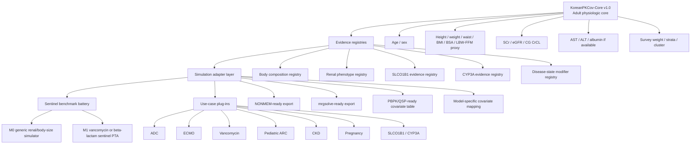
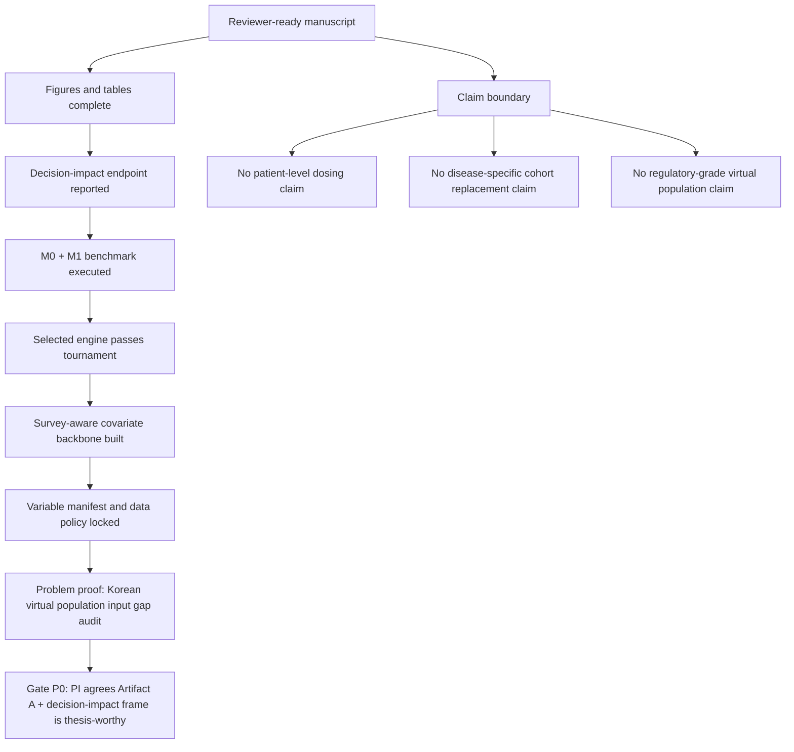
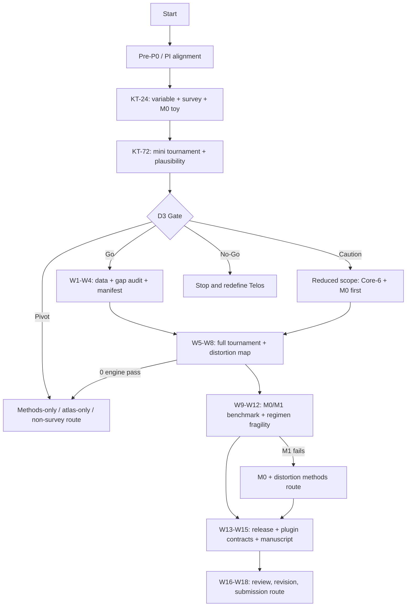
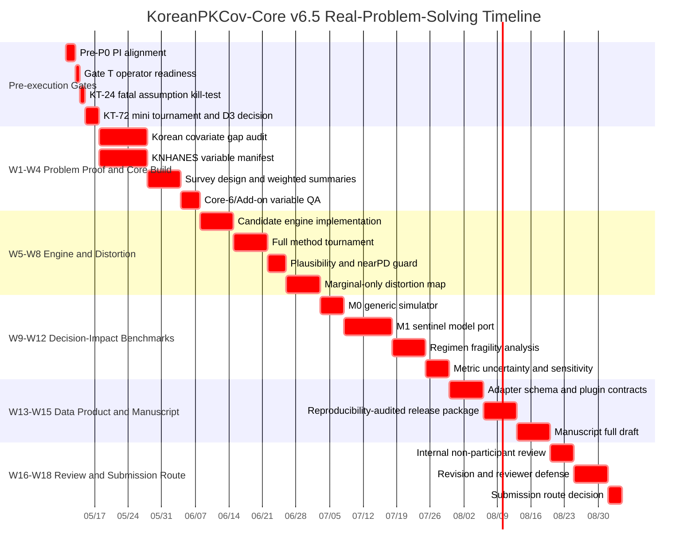
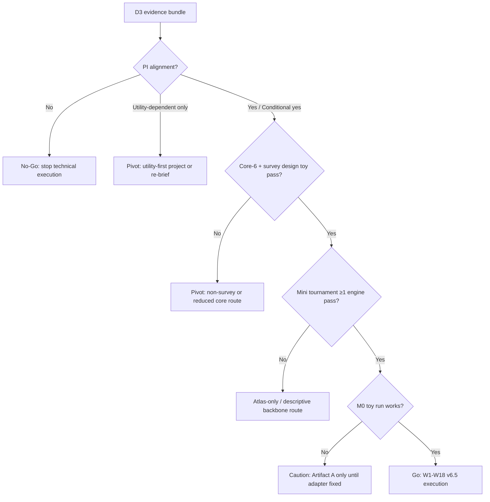

# KoreanPKCov-Core v6.5 — Real-Problem-Solving Launch Playbook

## 0. Final Judgment

**v6.5의 결론은 “Go, but only as a real-problem-solving backbone study.”**

이 연구는 단순히 “KNHANES로 한국인 공변량 분포를 만들었다”는 연구가 되면 임팩트가 약하다. 그러나 다음 문제를 정면으로 해결하도록 설계하면 충분히 강한 학위논문·방법론 논문·연구실 Data Moat가 된다.

> **Model-informed pharmacometric simulation is only as credible as the virtual population used as its input.**  
> KoreanPKCov-Core v6.5는 한국인 대상 PK/PD simulation에서 반복적으로 취약했던 **virtual population input layer**를 재현 가능하고, survey-aware하며, downstream model에 연결 가능한 covariate backbone으로 표준화한다. 그리고 그 입력층의 차이가 **regimen robustness, PTA decision classification, exposure tail, subgroup fragility**에 어떤 영향을 주는지 sentinel benchmark로 검증한다.

v6.5는 v6.3의 방어적 구조를 유지하되, 연구의 전면 목적을 다음과 같이 바꾼다.

| 항목 | v6.3 중심 | v6.5 수정 |
|---|---|---|
| 연구 정체성 | survey-aware adult covariate engine | **Korean pharmacometric covariate backbone for real-world simulation decisions** |
| 핵심 문제 | 한국인 공변량 엔진 부재 | **virtual population input credibility gap** |
| 주요 endpoint | fidelity, plausibility, optional utility | **decision-impact: PTA robustness, decision flip, failure probability, tail fragility** |
| 확장성 | future/supplement | **Core–Registry–Adapter–Plug-in architecture로 본문 전면화** |
| benchmark | M0 generic primary | **M0 + 최소 1개 M1 sentinel benchmark** |
| 장기 목적 | Data Moat 암묵적 | **Data Moat를 명시적 product architecture로 고정** |

---

## 1. Why This Study Was Planned

### 1.1 Origin Story

이 연구는 “새로운 통계 방법을 하나 더 만들기 위해서” 기획된 것이 아니다. 출발점은 훨씬 실무적이다.

계량약리학에서는 PopPK 모델, PK/PD 모델, NONMEM, mrgsolve, PTA simulation, clinical trial simulation은 점점 정교해지고 있다. 그러나 많은 simulation에서 **모델에 입력하는 virtual population은 상대적으로 조잡하게 구성된다.** 실제 분석 현장에서는 다음과 같은 일이 반복된다.

| 반복되는 현장 문제 | 왜 위험한가 |
|---|---|
| age, weight, SCr, renal function을 독립적으로 샘플링 | 생물학적으로 드문 조합 또는 불가능한 조합 생성 |
| non-Korean 또는 generic virtual population 사용 | 한국인 체격, renal phenotype, tail phenotype 미반영 |
| marginal distribution만 맞추고 joint structure 무시 | 평균은 맞지만 subgroup/tail에서 PTA와 exposure 해석이 흔들림 |
| survey design weight/strata/cluster 무시 | 국가대표 자료의 의미를 분석 단계에서 훼손 |
| 매 프로젝트마다 공변량 생성 코드를 새로 만듦 | 재현성, 검토 가능성, lab-level 축적 실패 |
| downstream model과 covariate mapping이 표준화되지 않음 | vancomycin, ADC, CKD, pregnancy 등 후속 연구로 연결되지 않음 |

따라서 이 연구의 기획 이유는 다음 한 문장으로 정리된다.

> **정교한 PK/PD 모델을 쓰면서도 조잡한 virtual population input 때문에 regimen simulation의 신뢰성이 제한되는 문제를 줄이기 위해서다.**

### 1.2 Practical Pain Point

이 연구가 실제 현장에서 줄이고 싶은 오류는 다음과 같다.

```text
Published PopPK/PK-PD model
        ↓
Simulation population?
        ↓
Default / marginal-only / non-Korean / non-survey-aware input
        ↓
Distorted joint phenotypes
        ↓
Uncertain PTA, exposure tail, subgroup risk classification
        ↓
Weak or misleading regimen robustness conclusion
```

KoreanPKCov-Core v6.5는 이 흐름을 다음으로 바꾸는 것을 목표로 한다.

```text
Published PopPK/PK-PD model
        ↓
KoreanPKCov-Core survey-aware covariate backbone
        ↓
Validated joint phenotype generation
        ↓
M0/M1 sentinel simulation
        ↓
Regimen robustness, failure probability, tail phenotype fragility, decision flip assessment
        ↓
Reusable adapter for later vancomycin / ADC / CKD / PGx / pregnancy / ECMO projects
```

---

## 2. The Problem to Solve and Why It Matters

## 2.1 Core Problem: Korean Virtual Population Input Credibility Gap

**문제 정의:**  
한국인 대상 model-informed pharmacometric simulation에서, model 자체는 정교하지만 virtual population input은 한국인 생리학적 공변량의 joint distribution, survey design, tail phenotype, downstream model mapping을 충분히 반영하지 못하는 경우가 많다.

이 문제는 단순한 데이터 정리 문제가 아니다. 다음 결정에 직접 영향을 줄 수 있다.

| Simulation decision | Input credibility가 낮으면 생기는 문제 |
|---|---|
| PTA ≥90% 여부 | 평균 PTA는 유지되지만 renal/body-size tail에서 target 미달 가능 |
| AUC/Cmax exposure distribution | underexposure 또는 overexposure tail 과소/과대평가 |
| subgroup risk interpretation | 고령, 저체중, renal impairment subgroup 위험이 가려짐 |
| dose optimization | “충분하다”는 regimen 결론이 특정 tail phenotype에서 취약할 수 있음 |
| clinical trial simulation | 한국인 recruitment/covariate mix 반영 부족 |
| extrapolation to special populations | CKD, pregnancy, ECMO, pediatric ARC로 확장할 때 공통 backbone 부재 |

## 2.2 Why Solving This Is Important

이 연구의 중요성은 네 층이다.

### Layer 1. Scientific Credibility

PK/PD model이 아무리 정교해도, 입력되는 virtual population이 현실과 맞지 않으면 simulation conclusion은 취약하다. KoreanPKCov-Core는 **input population credibility**를 독립된 방법론 문제로 격상시킨다.

### Layer 2. Practical Reuse

매 연구마다 age, weight, SCr, eGFR, BMI, BSA, waist, AST/ALT를 다시 정리하지 않고, 재현 가능한 backbone과 adapter를 재사용할 수 있다. 이는 연구실 내부 생산성을 높이고, 외부 reviewer에게도 분석의 투명성을 제공한다.

### Layer 3. Clinical Simulation Relevance

본 연구는 직접 환자 용량을 권고하지 않는다. 그러나 기존 regimen simulation이 한국인 covariate dependence와 tail phenotype에서도 robust한지 평가할 수 있다. 특히 vancomycin, β-lactam, CKD, body-size sensitive drug, ADC exposure-safety simulation으로 이어질 수 있다.

### Layer 4. Data Moat

이 연구의 장기 가치는 단일 논문이 아니라, 다음 연구들의 공통 재료를 축적하는 데 있다.

| Downstream project | KoreanPKCov-Core에서 제공하는 공통 재료 | 추가 plug-in 필요 |
|---|---|---|
| #1 ADC | body size, BSA, BMI, waist, hepatic/renal proxy | tumor burden, payload-specific marker, albumin/inflammation |
| #3 ECMO | age, weight, renal function | ECMO circuit, CRRT, albumin, critical illness state |
| #4 Vancomycin | age, weight, SCr, eGFR/CrCL | TDM, renal instability, MIC target |
| #5 Pediatric ARC | adult core는 직접 적용 불가; architecture 재사용 | pediatric maturation, oncology/FN, ARC-specific renal module |
| #16 CKD | renal phenotype distribution, eGFR/CrCL | disease-specific CKD calibration |
| #19 Pregnancy | adult female baseline | gestational age, trimester physiology |
| SLCO1B1 | population-level PGx prior 사양 | genotype/phenotype frequency registry |
| CYP3A | enzyme/transporter prior 사양 | genotype, inhibitor/inducer, hepatic function |
| Body composition | BMI, waist, BSA, LBW/FFM proxy | DEXA/BIA/external calibration if available |

---

## 3. What This Study Can and Cannot Solve

## 3.1 Problems This Study Can Solve

| 문제 | v6.5 해결 방식 | 산출물 |
|---|---|---|
| 한국인 virtual population input 부재 | KNHANES 기반 survey-aware adult physiologic backbone 구축 | `KoreanPKCov-Core v1.0` |
| 공변량 joint structure 무시 | marginal-only vs dependence-preserving distortion map | `figure_joint_distortion.html` |
| 생물학적으로 어색한 조합 생성 | plausibility audit + impossible/implausible combination rules | `plausibility_audit_report.html` |
| simulation conclusion의 취약성 불명확 | regimen fragility index + decision-impact endpoints | `regimen_fragility_report.html` |
| 매 연구마다 공변량 코드 재작성 | adapter-ready reproducibility package | `/release/repro_audited/` |
| 후속 연구로 연결되는 공통 재료 부족 | Core–Registry–Adapter–Plug-in contract | `plugin_contracts/` |
| reviewer가 “virtual population credibility”를 공격 | claim boundary + rebuild log + method tournament | `CLAIM_BOUNDARY.md`, `rebuild_log.txt`, `tournament_report.html` |

## 3.2 Problems This Study Cannot Solve

| 해결할 수 없는 문제 | 이유 | 방어 문구 |
|---|---|---|
| 개별 환자 용량 권고 | KNHANES 기반 population simulation이지 patient-level decision support가 아님 | “not intended for patient-level dosing recommendation” |
| 모든 한국인 임상 코호트 대표 | KNHANES는 일반 성인 population이며 inpatient/ICU/disease cohort가 아님 | “physiologic background covariate backbone, not disease-specific cohort replacement” |
| 소아, 임산부, ECMO, CKD advanced disease를 직접 대표 | 각 집단은 별도 physiology/disease-state plug-in 필요 | “future plug-ins requiring additional evidence and validation” |
| SLCO1B1/CYP3A genotype-level simulation 완성 | 1차 논문은 evidence registry/contract 수준 | “PGx registry specification, not full genotype-level engine” |
| clinical outcome improvement 증명 | simulation study이며 prospective outcome trial이 아님 | “simulation consequence and decision robustness, not clinical outcome proof” |
| regulatory-grade virtual population | 품질 감사는 가능하지만 규제 제출급 검증은 별도 | “reproducibility-audited, not regulatory-grade validated virtual population” |

---

## 4. v6.5 Research Identity

## 4.1 One-Line Definition

> **KoreanPKCov-Core v6.5 is a reproducibility-audited, survey-aware Korean adult pharmacometric covariate backbone designed to improve the credibility of virtual population input and to evaluate regimen robustness in Korean-relevant tail phenotypes.**

## 4.2 Not “PTA Improvement,” but “Regimen Robustness”

피해야 할 표현:

> Korean covariates improve PTA.

사용할 표현:

> Korean covariate dependence can alter, confirm, or challenge PTA robustness conclusions, especially in renal, body-size, and age-related tail phenotypes.

즉, v6.5의 핵심 endpoint는 다음이다.

| 이전 표현 | v6.5 표현 |
|---|---|
| PTA improvement | PTA robustness |
| PTA increase | PTA shift |
| ΔPTA ≥5%p | ΔPTA + failure probability + decision flip |
| clinical utility | target-specific simulation consequence |
| average PTA | subgroup and tail phenotype fragility |
| significant difference | decision-impact threshold |

---

## 5. Telos and Entelechy

## 5.1 Telos Lock

> **Telos:** KoreanPKCov-Core v6.5의 목적은 한국인 대상 model-informed pharmacometric simulation에서 반복적으로 취약했던 virtual population input layer를 재현 가능하고 survey-aware한 covariate backbone으로 표준화하고, 이 입력층이 regimen robustness, exposure tail, PTA decision classification, downstream plug-in readiness에 미치는 영향을 검증하여, 분석자·PI·reviewer·연구실·외부 사용자의 판단을 실제로 바꾸는 것이다.

## 5.2 Entelechy: Observable Completion Conditions

v6.5는 다음 조건이 충족되어야 완수된다.

| Entelechy ID | 완수조건 | 최소 산출물 | 통과 기준 |
|---|---|---|---|
| **E0 Problem Proof** | Korean virtual population input gap이 실제로 존재함을 보임 | `covariate_gap_audit.xlsx`, `gap_audit_summary.md` | 한국인/국내 PopPK/PK-PD simulation ≥20편에서 input population 방식 요약 |
| **E1 Survey Core** | survey-aware adult physiologic backbone 구축 | `svy_design.rds`, `survey_summary.html`, `variable_manifest.xlsx` | Core variables weighted summary 재현 가능 |
| **E2 Engine Tournament** | 최소 1개 covariate generation engine 통과 | `tournament_comparison_table.html` | fidelity + plausibility + rebuildability 기준 충족 |
| **E3 Distortion Map** | marginal-only/default 대비 joint/tail distortion 정량화 | `figure_joint_distortion.html`, `distortion_report.html` | 주요 pair/tail phenotype의 보존/왜곡 결과 제시 |
| **E4 Regimen Robustness** | M0 + 최소 1개 M1 sentinel benchmark 수행 | `M0_report.html`, `M1_sentinel_report.html` | PTA robustness, failure probability, decision flip 중 ≥1개 endpoint 보고 |
| **E5 Adapter Contract** | downstream plug-in 구조 정의 | `plugin_contracts/`, `adapter_schema.json` | vancomycin, ADC, CKD, SLCO1B1/CYP3A, pregnancy/ECMO/ARC contract 초안 |
| **E6 Rebuildability** | clean-session rebuild 가능 | `rebuild_log.txt`, `hash_policy.md`, `sessionInfo.txt` | core output 재생성 가능 |
| **E7 Manuscript Readiness** | Methods/Results/Discussion skeleton 완성 | `manuscript_A_draft.qmd` | figure/table placeholder가 실제 산출물과 연결 |
| **E8 Claim Safety** | 과대주장 방지 | `CLAIM_BOUNDARY.md`, `reviewer_attack_defense.md` | “not dosing recommendation / not disease-specific cohort replacement” 명시 |

---

## 6. Architecture: Core → Registry → Adapter → Plug-in



## 6.1 Core Claim Boundary

| 구분 | 논문에서 주장 | 논문에서 주장하지 않음 |
|---|---|---|
| Adult core | 한국인 성인 생리학적 공변량 backbone | 전체 한국인 virtual population |
| Survey-aware | KNHANES 복합표본설계 반영 | 모든 임상 코호트 대표 |
| Adapter | NONMEM/mrgsolve/PBPK export 가능 | disease-specific validity 자동 보장 |
| PGx registry | SLCO1B1/CYP3A plug-in 사양 제시 | genotype-level simulation 완성 |
| Use-case roadmap | ADC/ECMO/vancomycin/ARC/CKD/pregnancy 연결성 제시 | 모든 후속 연구를 1차 논문에서 검증 |
| Benchmark | regimen robustness와 simulation consequence 평가 | 임상 용량 권고 또는 outcome 개선 증명 |

---

## 7. Methodology for High-Quality Realization

v6.5에서 80% 이상의 집중 역량은 다음 7개에 투입한다. 이외 요소는 과감히 supplement, roadmap, future plug-in으로 낮춘다.

## 7.1 80% Focus Set

| Priority | Focus | 왜 중요한가 | 실패 시 |
|---|---|---|---|
| 1 | Variable manifest + survey design | 연구의 기반 | No-Go 또는 non-survey route |
| 2 | Engine tournament | “어떤 방법이 방어 가능한가” 결정 | atlas-only pivot |
| 3 | Plausibility audit | 생물학적 credibility | rule patch 전까지 benchmark 금지 |
| 4 | Marginal-only distortion map | 실제 방법론 기여 | Figure 2 약화 |
| 5 | M0 + M1 sentinel benchmark | 실제 문제 해결성 | M1 실패 시 M0+distortion methods paper |
| 6 | Rebuildability/release package | Data product화 | publication claim 축소 |
| 7 | Manuscript shell from W6 | 분석만 하고 글이 안 나오는 위험 차단 | W6 이후 분석 freeze |

## 7.2 Data and Variable Handling

| Step | 구체적 작업 | QA 기준 |
|---|---|---|
| Data acquisition | KNHANES adult 26–79 public data 확보 | cycle, weight, strata, cluster 명시 |
| Variable manifest | 원변수명, harmonized name, 단위, 결측 코드, cycle별 가용성 정리 | 모든 core variable에 unit/missing/transform rule 존재 |
| Core-6 | age, sex, height, weight, waist, SCr | Core-6 모두 pass |
| Add-on | AST, ALT, albumin if available | add-on downgrade 가능하나 문서화 |
| Derived variables | BMI, BSA, eGFR, CG CrCL, renal category | formula version lock |
| Survey design | `svydesign` object 생성 | weighted summary가 독립 재현 가능 |
| Missingness | missingness table + imputation/exclusion policy | variable별 policy 사전 지정 |

## 7.3 Engine Tournament

후보 엔진은 “가장 화려한 모델”이 아니라 “가장 방어 가능한 모델”을 고른다.

| Engine | 지위 | 장점 | 위험 |
|---|---|---|---|
| E0 weighted empirical bootstrap | 기본 후보 | 단순, 재현성 높음 | tail smoothing 제한 |
| E1 survey-stratified bootstrap | 기본 후보 | survey 구조 보존 가능 | strata/cell sparse issue |
| E2 weighted Gaussian copula | 조건부 후보 | dependence modeling 가능 | nearPD distortion |
| E3 vine/copula plugin | optional | 복잡한 dependence 가능 | critical path 제외 |
| E4 marginal-only/default | comparator | 왜곡 기준선 | winner 아님 |

### Tournament Metrics

| Family | Metric | Pass 기준 |
|---|---|---|
| Marginal fidelity | weighted mean, SD, P10/P50/P90 | 사전 지정 tolerance 내 |
| Dependence fidelity | Spearman/Kendall pair structure | top biological pairs 방향성 보존 |
| Tail phenotype | old + low weight + renal impairment, high BMI, low body size | tail prevalence distortion 정량화 |
| Plausibility | impossible/implausible rate | impossible 0 |
| Stability | seed-to-seed variability | crash 0, major metric drift 없음 |
| Rebuildability | clean-session output | hash/tolerance match |
| Interpretability | method transparency | reviewer 설명 가능 |

### Tie-breaker

1. survey design을 덜 훼손하는 후보  
2. biological plausibility가 높은 후보  
3. tail phenotype preservation이 좋은 후보  
4. dependence fidelity가 좋은 후보  
5. rebuildability가 좋은 후보  
6. runtime/dependency 부담이 낮은 후보  
7. 여전히 동률이면 가장 단순한 후보  

## 7.4 Distortion Map

| 분석 | 목적 |
|---|---|
| Marginal-only vs selected engine | independent sampling이 무엇을 왜곡하는지 보여줌 |
| Joint pair map | age–SCr/eGFR, height–weight, waist–BMI, AST–ALT |
| Tail phenotype preservation | 고령+저체중+renal impairment, obesity+renal phenotype |
| Category shift | eGFR/CrCL category, weight band, BMI class |
| Biological impossibility | 불가능/비현실 조합 rate |
| Figure output | `figure_joint_distortion.html`, `Figure2_distortion_map.tiff` |

## 7.5 Regimen Fragility Index

PTA를 단독 endpoint로 쓰지 않는다.

| Index | Definition | 해석 |
|---|---|---|
| ΔPTA | PTA_selected_engine − PTA_marginal/default | target attainment estimate shift |
| Δfailure probability | (1−PTA_selected) − (1−PTA_default) | target failure burden change |
| Decision flip | PTA ≥90% ↔ PTA <90% | regimen conclusion flip |
| Tail underexposure | lower 5–10% exposure below target | 취약 tail 증가 여부 |
| Upper exposure/toxicity tail | upper 5–10% exposure | safety-sensitive benchmark에서 사용 |
| Subgroup fragility | renal/body-size/age subgroup별 PTA 차이 | 평균 PTA가 가리는 취약군 |
| Reclassification rate | risk category 이동 비율 | decision-impact endpoint |

## 7.6 Sentinel Benchmark Battery

### Required

| Tier | Benchmark | 목적 | Pass |
|---|---|---|---|
| M0 | Generic renal/body-size simulator | engine-to-simulation adapter 작동 확인 | run success + exposure shift report |
| M1 | Vancomycin 또는 adult β-lactam renal-sensitive PTA | 실제 문제 연결성 확보 | PTA robustness / failure probability / decision flip report |

### Optional / Roadmap

| Tier | Benchmark | 처리 |
|---|---|---|
| M2 | Statin–SLCO1B1 toy/evidence registry | supplement 또는 roadmap |
| M3 | CYP3A-sensitive substrate toy | supplement 또는 roadmap |
| M4 | ADC body-composition exposure toy | roadmap |
| M5 | CKD/pregnancy/ECMO requirement spec | roadmap |

### M1 Selection Rule

| 조건 | 선택 |
|---|---|
| published model port가 빠르게 가능 | vancomycin 또는 β-lactam published model |
| published model port가 지연 | transparent generic renal-sensitive PTA model |
| MIC/target 불명확 | scenario grid로 전환 |
| M1이 W8까지 실패 | M1은 supplement/future로 내리고 M0+distortion methods paper로 전환 |

---

## 8. Backward Design From Reviewer Attacks

## 8.1 Reviewer Attack Defense Map

| Reviewer attack | 왜 위험한가 | v6.5 방어 설계 | 필수 산출물 |
|---|---|---|---|
| “그냥 KNHANES 요약 아닌가?” | novelty 약화 | engine tournament + adapter + sentinel benchmark | `tournament_report.html`, `M1_report.html` |
| “임상 코호트가 아닌데 왜 dosing simulation?” | external validity 공격 | physiologic background backbone이라고 명시 | `CLAIM_BOUNDARY.md` |
| “survey-aware라고 하지만 실제로 반영했나?” | title-level claim 붕괴 | `svydesign`, weighted summary, weight-aware validation | `svy_design.rds`, `survey_summary.html` |
| “분포 차이는 당연하다” | Gate C-D tautology | decision-impact endpoint로 연결 | `regimen_fragility_report.html` |
| “PTA 5%p 기준이 임의적이다” | utility 공격 | failure probability, decision flip, uncertainty interval 병행 | `metric_pre_registration.md` |
| “M0 toy simulator는 실제 문제가 아니다” | 실제 임팩트 약화 | M1 sentinel benchmark 필수화 | `M1_sentinel_report.html` |
| “PGx/ECMO/pregnancy까지 과대확장했다” | scope creep | plug-in contract만 제시, 직접 대표 주장 금지 | `plugin_contracts/README.md` |
| “virtual population이 validated되었나?” | 과대주장 공격 | validated 대신 reproducibility-audited 사용 | Title/Abstract/Claim boundary |
| “재현 가능한가?” | data product 신뢰성 공격 | toy data, rebuild notebook, expected outputs | `/release/repro_audited/` |
| “논문은 되지만 실제 재사용은 안 될 것” | Data Moat 실패 | NONMEM/mrgsolve/PBPK adapter schema 제공 | `adapter_schema.json` |
| “결과가 null이면?” | publication risk | Artifact A + distortion map + release package로 생존 | MVS-A/B/C 구조 |

## 8.2 Backward Completion Logic



---

## 9. Forward Execution Check



---

## 10. Full Gantt Timeline

**현실적 총 기간:** 시작부터 submission-ready package까지 **18주**.  
**최소 논문 골격:** 12주.  
**학위 챕터 생존 산출물:** 8–10주.  
**강한 journal submission package:** 16–18주.

기준 시작일은 예시로 **2026-05-11**로 둔다. 실제 시작일이 바뀌면 모든 날짜는 D0 기준으로 이동한다.



---

## 11. Stage-by-Stage Execution Board

## Phase 0. Pre-execution Hard Gates

| Stage | 목표 | 산출물 | 통과 기준 | 실패 시 |
|---|---|---|---|---|
| Pre-P0 | PI가 v6.5 Telos를 이해하고 Artifact A + decision-impact frame 인정 | `P0_brief_v6.5.md` | yes/conditional yes | Telos 재정의 |
| Gate T | 실행자·환경 준비 | `operator_readiness.md` | R/Python, survey, mrgsolve or M0, repo skeleton 준비 | 1주 기술 준비 |
| KT-24 | 가장 싼 fatal assumption 제거 | `KT24_summary.md` | Core-6 rough pass, survey object toy, M0 toy run | 축소/중단 |
| KT-72 | mini tournament 가능성 확인 | `mini_tournament_report.html` | ≥1 engine toy pass + plausibility 0 impossible | atlas-only pivot |
| D3 Gate | Go/Caution/Pivot/No-Go 결정 | `D3_gate_decision.md` | 단일 판정 | 판정 없으면 본실행 금지 |

## Phase 1. Problem Proof and Core Build

| Stage | 목표 | 산출물 | 통과 기준 |
|---|---|---|---|
| W1 Covariate gap audit | 한국인 virtual population input gap 증명 | `covariate_gap_audit.xlsx` | ≥20편 검토, simulation population source 기록 |
| W2 Variable manifest | KNHANES variable map 확정 | `variable_manifest.xlsx` | Core-6 all pass, add-on downgrade documented |
| W3 Survey design | survey-aware backbone 생성 | `svy_design.rds`, `survey_summary.html` | weighted summary 재현 |
| W4 Derived variables | BMI/BSA/eGFR/CG CrCL 생성 | `derived_variable_report.html` | formula version lock, unit QA pass |

## Phase 2. Engine and Distortion

| Stage | 목표 | 산출물 | 통과 기준 |
|---|---|---|---|
| W5 Candidate engines | E0/E1/E2/E3 후보 구현 | `candidate_engine_schema.md` | common output schema |
| W6 Full tournament | winner 선정 | `tournament_comparison_table.html` | ≥1 engine pass |
| W7 Plausibility audit | impossible/implausible 검출 | `plausibility_audit_report.html` | impossible 0 |
| W8 Distortion map | marginal-only 왜곡 시각화 | `figure_joint_distortion.html` | biological pair/tail/category shift 보고 |

## Phase 3. Decision-Impact Benchmark

| Stage | 목표 | 산출물 | 통과 기준 |
|---|---|---|---|
| W9 M0 simulator | adapter 작동 확인 | `M0_generic_report.html` | run success, exposure output |
| W10 M1 sentinel | 실제 문제 연결 | `M1_model_port_log.md` | vancomycin 또는 β-lactam model/scenario 실행 |
| W11 Fragility index | PTA robustness 분석 | `regimen_fragility_report.html` | ΔPTA, failure probability, decision flip, subgroup fragility 보고 |
| W12 Sensitivity | uncertainty/sensitivity | `sensitivity_report.html` | MC error, seed stability, threshold sensitivity |

## Phase 4. Data Product and Manuscript

| Stage | 목표 | 산출물 | 통과 기준 |
|---|---|---|---|
| W13 Adapter schema | 후속 연구 연결 | `adapter_schema.json`, `/plugin_contracts/` | NONMEM/mrgsolve/PBPK-ready |
| W14 Release | 재현성 패키지 | `/release/repro_audited/` | README, toy data, rebuild notebook |
| W15 Manuscript | 논문 초안 | `manuscript_A_draft.qmd` | Figure 1–5, Table 1–4 연결 |
| W16 Review | 내부 검토 | `internal_methods_review.md` | major issue triaged |
| W17 Revision | reviewer attack 방어 | `reviewer_attack_defense.md` | 주요 공격마다 response |
| W18 Route | 제출 경로 결정 | `journal_route_decision.md` | A1/A2/A3/B/C/D 중 하나 |

---

## 12. Decision Branches

## 12.1 D3 Gate



## 12.2 W8 Gate

| W8 판정 | 조건 | 다음 행동 |
|---|---|---|
| Go | engine winner + plausibility pass + distortion map exists | M0/M1 benchmark 진행 |
| Caution | engine pass but distortion weak | M0/M1으로 decision-impact 보강 |
| Pivot | 0 engine pass | atlas-only or methods note |
| No-Go | survey design and engine both fail | Telos reset |

## 12.3 W12 Gate

| W12 판정 | 조건 | Route |
|---|---|---|
| A1 | M1에서 decision-impact signal weak+ | methods + sentinel utility paper |
| A2 | M1 null but distortion strong | methods + distributional consequence paper |
| A3 | M1 null and distortion modest but release strong | reproducibility-audited backbone paper |
| B | manuscript incomplete but MVS-A complete | thesis chapter first |
| C | engine/data product strong but benchmark failed | methods note + release |
| D | legal/data release constrained | internal thesis + reproducibility audit |

---

## 13. Manuscript Figure and Table Plan

## Figures

| Figure | 제목 | 메시지 |
|---|---|---|
| Figure 1 | The recurring input-population problem in Korean pharmacometric simulation | 연구를 왜 하는지 한눈에 보임 |
| Figure 2 | KoreanPKCov-Core architecture: Core → Registry → Adapter → Plug-in | Data Moat와 확장성 |
| Figure 3 | Survey-aware joint phenotype and marginal-only distortion map | 한국인 joint structure 보존 필요성 |
| Figure 4 | Method tournament and winner selection | 가장 방어 가능한 engine |
| Figure 5 | Regimen fragility benchmark | PTA robustness, failure probability, decision flip |
| Figure 6 | Snowball roadmap | ADC, ECMO, vancomycin, ARC, CKD, pregnancy, PGx |

## Tables

| Table | 내용 |
|---|---|
| Table 1 | Korean covariate gap audit |
| Table 2 | Variable manifest and derived covariate definitions |
| Table 3 | Method tournament metrics |
| Table 4 | Regimen fragility endpoints |
| Table 5 | Plug-in compatibility matrix |
| Supplement Table S1 | Missingness/unit/cycle map |
| Supplement Table S2 | Reviewer attack defense map |
| Supplement Table S3 | Release package contents and rebuild hash |

---

## 14. Repository Structure v6.5

```text
/KoreanPKCov-Core/
├── README.md
├── CLAIM_BOUNDARY.md
├── DATA_POLICY.md
├── ETHICS.md
├── decision_log.md
├── metric_pre_registration.md
├── reviewer_attack_defense.md
├── /problem_proof/
│   ├── covariate_gap_audit.xlsx
│   ├── gap_audit_summary.md
│   └── included_studies_log.md
├── /data_manifest/
│   ├── variable_manifest.xlsx
│   ├── variable_harmonization_report.html
│   ├── derived_variable_report.html
│   └── 6plus2_core_policy.md
├── /R/
│   ├── 00_setup.R
│   ├── 01_load_knhanes.R
│   ├── 02_survey_design.R
│   ├── 03_variable_manifest.R
│   ├── 04_candidate_engines.R
│   ├── 05_tournament_metrics.R
│   ├── 06_plausibility_audit.R
│   ├── 07_distortion_map.R
│   ├── 08_M0_generic_simulator.R
│   ├── 09_M1_sentinel_model.R
│   ├── 10_regimen_fragility.R
│   ├── 11_stability_rebuild.R
│   └── 12_export_adapters.R
├── /python/
│   ├── schemas.py
│   ├── validation_checks.py
│   └── release_hash.py
├── /evidence/
│   ├── KT24_summary.md
│   ├── D3_gate_decision.md
│   ├── tournament_comparison_table.html
│   ├── plausibility_audit_report.html
│   ├── figure_joint_distortion.html
│   ├── M0_generic_report.html
│   ├── M1_sentinel_report.html
│   ├── regimen_fragility_report.html
│   ├── sensitivity_report.html
│   ├── stability_report.html
│   └── rebuild_log.txt
├── /adapters/
│   ├── adapter_schema.json
│   ├── nonmem_export_spec.md
│   ├── mrgsolve_export_spec.md
│   └── pbpk_qsp_export_spec.md
├── /plugin_contracts/
│   ├── README.md
│   ├── vancomycin_contract.md
│   ├── adc_contract.md
│   ├── ckd_contract.md
│   ├── pregnancy_contract.md
│   ├── ecmo_contract.md
│   ├── pediatric_arc_contract.md
│   ├── slco1b1_contract.md
│   └── cyp3a_contract.md
├── /release/
│   └── repro_audited/
│       ├── README.md
│       ├── toy_data.csv
│       ├── rebuild_notebook.qmd
│       ├── expected_outputs/
│       ├── expected_hashes.json
│       └── sessionInfo.txt
└── /manuscript/
    ├── manuscript_A_draft.qmd
    ├── figures/
    ├── tables/
    ├── supplement/
    ├── journal_route_decision.md
    └── response_to_reviewer_attacks.md
```

---

## 15. Forward and Backward Validation Checklist

## 15.1 Backward Check

| Final requirement | 필요한 선행 산출물 | 상태 |
|---|---|---|
| Reviewer-ready paper | Figure 1–6, Table 1–5 | W15 |
| Decision-impact claim | M0/M1 benchmark + fragility index | W12 |
| Data Moat claim | adapter schema + plugin contracts | W13 |
| Survey-aware claim | `svy_design.rds`, weighted summary | W3 |
| Engine credibility | tournament + plausibility audit | W6–W7 |
| Real-problem statement | covariate gap audit | W1–W2 |
| Reproducibility | release package + rebuild log | W14 |

## 15.2 Forward Check

| Stage | 통과해야 다음 단계 가능 |
|---|---|
| Pre-P0 | PI yes/conditional yes 없으면 technical execution 금지 |
| KT-72 | mini tournament ≥1 pass 없으면 W1–W18 full route 금지 |
| W4 | variable manifest/survey summary 없으면 engine 구현 금지 |
| W8 | distortion map 없으면 M1 claim 약화 |
| W12 | fragility endpoint 없으면 임상적/decision-impact claim 금지 |
| W14 | rebuild package 없으면 reproducibility-audited claim 금지 |
| W15 | manuscript draft 없으면 추가 분석 금지 |
| W18 | route decision 없으면 submission 금지 |

---

## 16. Final PI-Facing Summary

> 이 연구는 단순히 KNHANES로 한국인 공변량 분포를 만드는 연구가 아닙니다. 한국인 대상 model-informed pharmacometric simulation에서 반복적으로 취약했던 virtual population input layer를 표준화하고, 그 입력층의 차이가 regimen robustness, exposure tail, PTA decision classification, subgroup fragility를 바꾸는지 검증하는 기반 연구입니다. 1차 논문은 adult physiologic core, survey-aware method tournament, marginal-only distortion map, M0/M1 sentinel benchmark, reproducibility-audited release package를 제시합니다. 후속 연구는 SLCO1B1/CYP3A, body composition, vancomycin, ADC, ECMO, pediatric ARC, CKD, pregnancy plug-in으로 확장됩니다. 따라서 본 연구는 학위논문으로도 생존하고, 연구실의 장기 Data Moat로도 누적됩니다.

---

## 17. v6.5 Final Go/No-Go Rubric

| Domain | Pass | Caution | No-Go |
|---|---|---|---|
| Real problem | covariate input gap audit 완료 | audit 일부 부족 | 문제정의가 “DB 만들기”에 머묾 |
| Survey core | survey design + weighted summary pass | 일부 cycle/variable issue | survey-aware claim 불가 |
| Engine | ≥1 winner engine | only descriptive engine | 0 pass |
| Distortion | joint/tail/category distortion map | weak distortion | no meaningful difference and no method contribution |
| Benchmark | M0 + M1 complete | M0 only, M1 supplement | no adapter benchmark |
| Fragility | decision-impact endpoints 보고 | ΔPTA만 보고 | p-value 중심 |
| Data Moat | adapter + plugin contracts | roadmap only | 후속 연결 없음 |
| Reproducibility | rebuild package pass | internal-only | 재현성 주장 불가 |
| Manuscript | W15 full draft | thesis chapter draft | no writing by W15 |

**Final v6.5 verdict:**  
**Hard-Gated Go** if D3 passes.  
**Full journal route** only if W12 decision-impact or W14 reproducibility package is strong.  
**Thesis-safe route** if E1–E3–E6 pass even when M1 is null.  
**Data Moat route** survives if adapter schema and plug-in contracts are completed.

